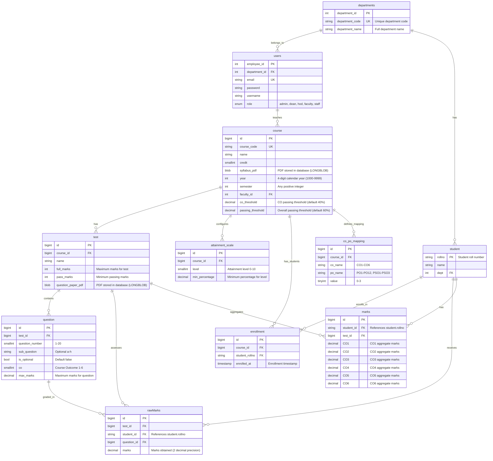

# NBA Assessment System - Database Schema

## ERD Diagram



---

## Table Definitions

### 1. departments

Organization structure for academic departments.

| Column          | Type         | Constraints                 | Description                          |
| --------------- | ------------ | --------------------------- | ------------------------------------ |
| department_id   | INT(11)      | PRIMARY KEY, AUTO_INCREMENT | Unique identifier                    |
| department_code | VARCHAR(10)  | UNIQUE, NOT NULL            | Short code (e.g., "CSE", "ECE")      |
| department_name | VARCHAR(100) | UNIQUE, NOT NULL            | Full name (e.g., "Computer Science") |

**Indexes**: PRIMARY KEY (department_id), UNIQUE KEY (department_name), UNIQUE KEY (department_code)

---

### 2. users

System users (faculty, HOD, admin, dean, staff) with JWT authentication.

| Column        | Type         | Constraints                                | Description                            |
| ------------- | ------------ | ------------------------------------------ | -------------------------------------- |
| employee_id   | INT(11)      | PRIMARY KEY                                | Unique identifier                      |
| department_id | INT(11)      | FOREIGN KEY → departments(department_id)   | Department assignment (NULL for admin) |
| email         | VARCHAR(64)  | UNIQUE, NOT NULL                           | Login email                            |
| password      | VARCHAR(255) | NOT NULL                                   | Bcrypt hashed password                 |
| username      | VARCHAR(64)  | NOT NULL                                   | Full name                              |
| role          | ENUM         | 'admin', 'dean', 'hod', 'faculty', 'staff' | Authorization level                    |

**Indexes**: PRIMARY KEY (employee_id), UNIQUE KEY (email), INDEX (department_id)  
**Foreign Keys**: department_id REFERENCES departments(department_id) ON DELETE SET NULL

---

### 3. course

Academic courses with syllabi, year/semester info, and attainment thresholds.

| Column            | Type         | Constraints                      | Description                        |
| ----------------- | ------------ | -------------------------------- | ---------------------------------- |
| id                | BIGINT       | PRIMARY KEY, AUTO_INCREMENT      | Unique identifier                  |
| course_code       | VARCHAR(20)  | UNIQUE, NOT NULL                 | Course code (e.g., "CS101")        |
| name              | VARCHAR(255) | NOT NULL                         | Full course name                   |
| credit            | SMALLINT     | NOT NULL, DEFAULT 0              | Credit hours                       |
| syllabus_pdf      | LONGBLOB     | NULL                             | Syllabus PDF (binary data)         |
| year              | INT          | NOT NULL, CHECK (1000-9999)      | Calendar year (e.g., 2024)         |
| semester          | INT          | NOT NULL                         | Semester number (1, 2, 3...)       |
| faculty_id        | INT(11)      | FOREIGN KEY → users(employee_id) | Course instructor                  |
| co_threshold      | DECIMAL(5,2) | DEFAULT 40.00                    | CO passing percentage (0-100)      |
| passing_threshold | DECIMAL(5,2) | DEFAULT 60.00                    | Overall passing percentage (0-100) |

**Indexes**: PRIMARY KEY (id), UNIQUE KEY (course_code), INDEX (faculty_id), INDEX (year, semester)  
**Foreign Keys**: faculty_id REFERENCES users(employee_id) ON DELETE RESTRICT

**PDF Filename**: Auto-generated as `{course_code}_{year}_{semester}.pdf`

---

### 4. attainment_scale

Configurable attainment level thresholds per course.

| Column         | Type         | Constraints                 | Description                             |
| -------------- | ------------ | --------------------------- | --------------------------------------- |
| id             | BIGINT       | PRIMARY KEY, AUTO_INCREMENT | Unique identifier                       |
| course_id      | BIGINT       | FOREIGN KEY → course(id)    | Parent course                           |
| level          | SMALLINT     | NOT NULL, CHECK (0-10)      | Attainment level (0=fail, 1-3=standard) |
| min_percentage | DECIMAL(5,2) | NOT NULL, CHECK (0-100)     | Minimum percentage for this level       |

**Indexes**: PRIMARY KEY (id), UNIQUE KEY (course_id, level), INDEX (course_id)  
**Foreign Keys**: course_id REFERENCES course(id) ON DELETE CASCADE

**Purpose**: Define custom attainment scales per course (e.g., Level 0: 0%, Level 1: 40%, Level 2: 60%, Level 3: 80%)

---

### 5. co_po_mapping

Mapping between Course Outcomes (CO) and Program Outcomes (PO) / Program Specific Outcomes (PSO).

| Column    | Type       | Constraints                 | Description                             |
| --------- | ---------- | --------------------------- | --------------------------------------- |
| id        | BIGINT     | PRIMARY KEY, AUTO_INCREMENT | Unique identifier                       |
| course_id | BIGINT     | FOREIGN KEY → course(id)    | Parent course                           |
| co_name   | VARCHAR(5) | NOT NULL                    | CO identifier (CO1-CO6)                 |
| po_name   | VARCHAR(5) | NOT NULL                    | PO/PSO identifier (PO1-PO12, PSO1-PSO3) |
| value     | TINYINT    | DEFAULT 0, CHECK (0-3)      | Correlation level (0-3)                 |

**Indexes**: PRIMARY KEY (id), UNIQUE KEY (course_id, co_name, po_name), INDEX (course_id)  
**Foreign Keys**: course_id REFERENCES course(id) ON DELETE CASCADE

---

### 6. test

Assessments with question papers (Mid-sem, End-sem, etc.).

| Column             | Type         | Constraints                 | Description                      |
| ------------------ | ------------ | --------------------------- | -------------------------------- |
| id                 | BIGINT       | PRIMARY KEY, AUTO_INCREMENT | Unique identifier                |
| course_id          | BIGINT       | FOREIGN KEY → course(id)    | Parent course                    |
| name               | VARCHAR(255) | NOT NULL                    | Test name (e.g., "Mid Semester") |
| full_marks         | INT          | NOT NULL                    | Maximum marks                    |
| pass_marks         | INT          | NOT NULL                    | Passing threshold                |
| question_paper_pdf | LONGBLOB     | NULL                        | Question paper PDF (binary)      |

**Indexes**: PRIMARY KEY (id), INDEX (course_id)  
**Foreign Keys**: course_id REFERENCES course(id) ON DELETE CASCADE

**PDF Filename**: Auto-generated as `{course_code}_{year}_{semester}_{test_name}.pdf`

---

### 7. question

Individual questions with CO mapping and marks.

| Column          | Type         | Constraints                 | Description                |
| --------------- | ------------ | --------------------------- | -------------------------- |
| id              | BIGINT       | PRIMARY KEY, AUTO_INCREMENT | Unique identifier          |
| test_id         | BIGINT       | FOREIGN KEY → test(id)      | Parent test                |
| question_number | SMALLINT     | NOT NULL, CHECK (1-20)      | Main question number       |
| sub_question    | VARCHAR(10)  | NULL                        | Sub-question (a-h or NULL) |
| is_optional     | BOOLEAN      | DEFAULT FALSE               | Optional question flag     |
| co              | SMALLINT     | NOT NULL, CHECK (1-6)       | Course Outcome mapping     |
| max_marks       | DECIMAL(5,2) | NOT NULL, CHECK (>= 0.5)    | Maximum marks              |

**Indexes**: PRIMARY KEY (id), INDEX (test_id), INDEX (test_id, question_number), UNIQUE KEY (test_id, question_number, sub_question)  
**Foreign Keys**: test_id REFERENCES test(id) ON DELETE CASCADE

**Note**: Question text is in the test's question_paper_pdf. This table only stores metadata.

---

### 8. student

Student information with roll numbers.

| Column | Type         | Constraints                              | Description         |
| ------ | ------------ | ---------------------------------------- | ------------------- |
| rollno | VARCHAR(20)  | PRIMARY KEY                              | Student roll number |
| name   | VARCHAR(100) | NOT NULL                                 | Full name           |
| dept   | INT(11)      | FOREIGN KEY → departments(department_id) | Department          |

**Indexes**: PRIMARY KEY (rollno), INDEX (dept)  
**Foreign Keys**: dept REFERENCES departments(department_id) ON DELETE RESTRICT

**Note**: No separate ID column - rollno serves as the primary key

---

### 9. enrollment

Student-course enrollment relationship.

| Column         | Type        | Constraints                   | Description       |
| -------------- | ----------- | ----------------------------- | ----------------- |
| id             | BIGINT      | PRIMARY KEY, AUTO_INCREMENT   | Unique identifier |
| course_id      | BIGINT      | FOREIGN KEY → course(id)      | Course            |
| student_rollno | VARCHAR(20) | FOREIGN KEY → student(rollno) | Student           |
| enrolled_at    | TIMESTAMP   | DEFAULT CURRENT_TIMESTAMP     | Enrollment time   |

**Indexes**: PRIMARY KEY (id), UNIQUE KEY (course_id, student_rollno), INDEX (course_id), INDEX (student_rollno)  
**Foreign Keys**:

- course_id REFERENCES course(id) ON DELETE CASCADE
- student_rollno REFERENCES student(rollno) ON DELETE CASCADE

**Constraint**: Prevents duplicate enrollments (same student in same course)

---

### 10. rawMarks

Per-question marks for each student.

| Column      | Type         | Constraints                   | Description         |
| ----------- | ------------ | ----------------------------- | ------------------- |
| id          | BIGINT       | PRIMARY KEY, AUTO_INCREMENT   | Unique identifier   |
| test_id     | BIGINT       | FOREIGN KEY → test(id)        | Test                |
| student_id  | VARCHAR(20)  | FOREIGN KEY → student(rollno) | Student roll number |
| question_id | BIGINT       | FOREIGN KEY → question(id)    | Question            |
| marks       | DECIMAL(5,2) | NOT NULL, CHECK (>= 0)        | Marks obtained      |

**Indexes**: PRIMARY KEY (id), UNIQUE KEY (test_id, student_id, question_id), INDEX (test_id, student_id), INDEX (student_id)  
**Foreign Keys**:

- test_id REFERENCES test(id) ON DELETE CASCADE
- student_id REFERENCES student(rollno) ON DELETE CASCADE
- question_id REFERENCES question(id) ON DELETE CASCADE

**Purpose**: Granular marks entry, used to calculate CO aggregates in `marks` table.

---

### 11. marks

CO-aggregated marks for each student per test.

| Column     | Type         | Constraints                   | Description         |
| ---------- | ------------ | ----------------------------- | ------------------- |
| id         | BIGINT       | PRIMARY KEY, AUTO_INCREMENT   | Unique identifier   |
| student_id | VARCHAR(20)  | FOREIGN KEY → student(rollno) | Student roll number |
| test_id    | BIGINT       | FOREIGN KEY → test(id)        | Test                |
| CO1        | DECIMAL(6,2) | DEFAULT 0, CHECK (>= 0)       | CO1 total marks     |
| CO2        | DECIMAL(6,2) | DEFAULT 0, CHECK (>= 0)       | CO2 total marks     |
| CO3        | DECIMAL(6,2) | DEFAULT 0, CHECK (>= 0)       | CO3 total marks     |
| CO4        | DECIMAL(6,2) | DEFAULT 0, CHECK (>= 0)       | CO4 total marks     |
| CO5        | DECIMAL(6,2) | DEFAULT 0, CHECK (>= 0)       | CO5 total marks     |
| CO6        | DECIMAL(6,2) | DEFAULT 0, CHECK (>= 0)       | CO6 total marks     |

**Indexes**: PRIMARY KEY (id), UNIQUE KEY (student_id, test_id), INDEX (test_id)  
**Foreign Keys**:

- student_id REFERENCES student(rollno) ON DELETE CASCADE
- test_id REFERENCES test(id) ON DELETE CASCADE

**Purpose**: NBA-ready CO aggregates. Auto-calculated from rawMarks based on question.co mapping.

---

## Schema Changes Log

### v2.1 (February 2026) - CO-PO Mapping Implementation

#### New Table: co_po_mapping

- ✅ **Added**: Complete table for mapping COs to POs and PSOs with correlation values (0-3)

#### Test Table

- ✅ **Renamed**: `test_name` to `name` to match `db.sql` implementation
- ✅ **Updated**: Corrected `id` and `course_id` types to `BIGINT`

---

### v2.0 (December 2025) - Attainment Configuration & Dean Role

#### Course Table

- ✅ **Added**: `co_threshold DECIMAL(5,2)` - CO passing percentage (default 40%)
- ✅ **Added**: `passing_threshold DECIMAL(5,2)` - Overall passing percentage (default 60%)
- ❌ **Removed**: `dept_id` (courses only linked to faculty, not department)

#### New Table: attainment_scale

- ✅ **Added**: Complete table for configurable attainment level thresholds per course
- **Purpose**: Define custom scales (e.g., Level 0: 0%, Level 1: 40%, Level 2: 60%, Level 3: 80%)

#### Users Table

- ✅ **Added**: `dean` role to ENUM values
- **Purpose**: Read-only access to all department data for institutional oversight

---

### v1.0 (January 2025) - PDF Storage Implementation

#### Course Table

- ❌ **Removed**: `syllabus VARCHAR(500)` (URL field)
- ✅ **Added**: `syllabus_pdf LONGBLOB` (binary PDF storage)
- **Filename**: Auto-generated as `{course_code}_{year}_{semester}.pdf`

#### Test Table

- ❌ **Removed**: `question_link VARCHAR(500)` (URL field)
- ✅ **Added**: `question_paper_pdf LONGBLOB` (binary PDF storage)
- **Filename**: Auto-generated as `{course_code}_{year}_{semester}_{test_name}.pdf`

#### Question Table

- ❌ **Removed**: `description TEXT` (question text)
- **Reason**: Question content is in the PDF, table only stores metadata

---

## Relationships

### One-to-Many

- **departments → users**: One department has many users
- **departments → student**: One department has many students
- **users → course**: One faculty teaches many courses
- **course → test**: One course has many tests
- **course → attainment_scale**: One course has many attainment level configurations
- **course → enrollment**: One course has many enrollments
- **test → question**: One test contains many questions
- **test → rawMarks**: One test has many raw marks entries
- **test → marks**: One test has many aggregate marks entries
- **student → enrollment**: One student enrolls in many courses
- **student → rawMarks**: One student has many raw marks entries
- **student → marks**: One student has many aggregate marks
- **question → rawMarks**: One question has many marks entries

### Unique Constraints

- **attainment_scale**: (course_id, level) - Prevents duplicate level configurations per course
- **enrollment**: (course_id, student_rollno) - Prevents duplicate enrollments
- **rawMarks**: (test_id, student_id, question_id) - One marks entry per question per student per test
- **marks**: (student_id, test_id) - One CO aggregate per test per student
- **question**: (test_id, question_number, sub_question) - Prevents duplicate questions

---

## Cascade Behavior

### ON DELETE Behavior

- **CASCADE**:
    - Delete department → Delete all students (users have SET NULL)
    - Delete course → Delete all tests, enrollments, attainment_scale entries
    - Delete test → Delete all questions, rawMarks, marks
    - Delete student → Delete all enrollments, rawMarks, marks
    - Delete question → Delete all rawMarks for that question
- **RESTRICT**:
    - Delete faculty (user) → Blocked if they have courses assigned
    - Delete department → Blocked if it has students
- **SET NULL**:
    - Delete department → Set department_id to NULL in users table (for admin compatibility)

**Purpose**: Maintain referential integrity, clean up orphaned data

---

## Design Philosophy

### Dual Marks Storage

- **rawMarks**: Granular per-question data for marks entry
- **marks**: CO aggregates for NBA reporting
- **Sync**: marks table updated automatically when rawMarks change

### PDF Storage

- **LONGBLOB**: Supports files up to ~4GB (recommend < 10MB)
- **Base64**: API uses base64 encoding for transmission
- **Auto-filenames**: Generated from course/test metadata for consistency
- **Backup**: Single database dump includes all documents

### Authorization

- **faculty_id in course**: Determines who can modify course/test/marks
- **role in users**: Admin (system-wide), Dean (read-only all), HOD (department-wide), Faculty (own courses), Staff (enrollment management)
- **JWT**: Token contains employee_id and role for authorization checks
- **Department isolation**: HOD/Staff can only access their department's data

---

## Performance Considerations

### Indexes

- Primary keys on all tables
- Foreign keys indexed automatically
- Unique constraints on business keys (rollno, email, course_code)
- Composite unique keys prevent duplicates

### Query Optimization

- SELECT excludes LONGBLOB columns by default
- Use explicit column selection for large tables
- JOIN queries use indexed foreign keys
- Aggregate queries (CO totals) use indexed marks table

### Storage

- LONGBLOB adds ~100KB-2MB per document
- For 100 courses + 500 tests: ~150MB additional storage
- Recommend separate download endpoints for large PDFs

---

## Setup

### Create Database

```sql
CREATE DATABASE nba_db CHARACTER SET utf8mb4 COLLATE utf8mb4_unicode_ci;
```

### Import Schema

```bash
mysql -u username -p nba_db < docs/db.sql
```

### Verify

```sql
USE nba_db;
SHOW TABLES;
-- Expected: 11 tables (departments, users, student, course, attainment_scale, co_po_mapping, test, question, enrollment, rawMarks, marks)
```

---

**See Also**:

- `db.sql` - Complete schema with sample data
- `API_REFERENCE.md` - API endpoints that use this schema
- `COMPLETE_GUIDE.md` - Full project documentation
