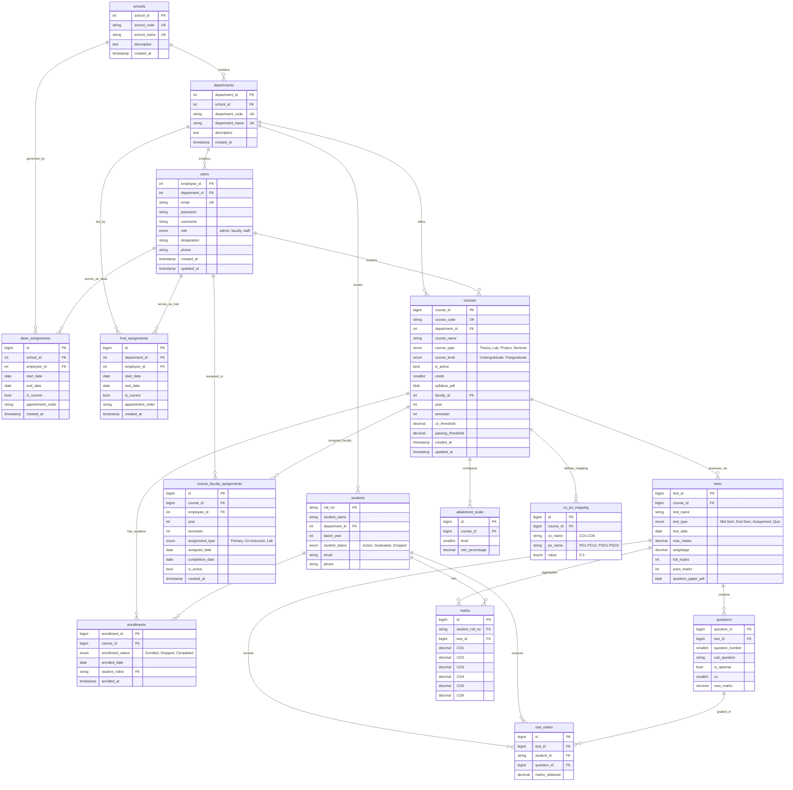

# NBA Assessment System - Database Schema v3.0

## ERD Diagram



---

## Table Definitions

### 1. schools

Top-level organizational unit grouping departments.

| Column      | Type         | Constraints                 | Description                               |
| ----------- | ------------ | --------------------------- | ----------------------------------------- |
| school_id   | INT(11)      | PRIMARY KEY, AUTO_INCREMENT | Unique identifier                         |
| school_code | VARCHAR(10)  | UNIQUE, NOT NULL            | Short code (e.g., "SoE")                  |
| school_name | VARCHAR(150) | UNIQUE, NOT NULL            | Full name (e.g., "School of Engineering") |
| description | TEXT         | NULL                        | Additional description                    |
| created_at  | TIMESTAMP    | DEFAULT CURRENT_TIMESTAMP   | Record creation timestamp                 |

**Indexes**: PRIMARY KEY (school_id), UNIQUE KEY (school_code), UNIQUE KEY (school_name)

---

### 2. departments

Academic departments within schools.

| Column          | Type         | Constraints                      | Description                          |
| --------------- | ------------ | -------------------------------- | ------------------------------------ |
| department_id   | INT(11)      | PRIMARY KEY, AUTO_INCREMENT      | Unique identifier                    |
| school_id       | INT(11)      | FOREIGN KEY → schools(school_id) | Parent school                        |
| department_code | VARCHAR(10)  | UNIQUE, NOT NULL                 | Short code (e.g., "CSE", "ECE")      |
| department_name | VARCHAR(100) | UNIQUE, NOT NULL                 | Full name (e.g., "Computer Science") |
| description     | TEXT         | NULL                             | Additional description               |
| created_at      | TIMESTAMP    | DEFAULT CURRENT_TIMESTAMP        | Record creation timestamp            |

**Indexes**: PRIMARY KEY (department_id), UNIQUE KEY (department_name), UNIQUE KEY (department_code), INDEX (school_id)  
**Foreign Keys**: school_id REFERENCES schools(school_id) ON DELETE RESTRICT

---

### 3. users

System users (faculty, admin, staff) with JWT authentication.  
**Note**: HOD and Dean roles are managed via `hod_assignments` and `dean_assignments` tables, not the role field.

| Column        | Type         | Constraints                              | Description                            |
| ------------- | ------------ | ---------------------------------------- | -------------------------------------- |
| employee_id   | INT(11)      | PRIMARY KEY                              | Unique identifier                      |
| department_id | INT(11)      | FOREIGN KEY → departments(department_id) | Department assignment (NULL for admin) |
| email         | VARCHAR(64)  | UNIQUE, NOT NULL                         | Login email                            |
| password      | VARCHAR(255) | NOT NULL                                 | Bcrypt hashed password                 |
| username      | VARCHAR(64)  | NOT NULL                                 | Full name                              |
| role          | ENUM         | 'admin', 'faculty', 'staff'              | Base authorization level               |
| designation   | VARCHAR(50)  | NULL                                     | Job title (e.g., "Professor")          |
| phone         | VARCHAR(15)  | NULL                                     | Contact phone number                   |
| created_at    | TIMESTAMP    | DEFAULT CURRENT_TIMESTAMP                | Record creation timestamp              |
| updated_at    | TIMESTAMP    | ON UPDATE CURRENT_TIMESTAMP              | Last update timestamp                  |

**Indexes**: PRIMARY KEY (employee_id), UNIQUE KEY (email), INDEX (department_id)  
**Foreign Keys**: department_id REFERENCES departments(department_id) ON DELETE SET NULL

---

### 4. hod_assignments

Historical tracking of Head of Department appointments.

| Column            | Type        | Constraints                              | Description                         |
| ----------------- | ----------- | ---------------------------------------- | ----------------------------------- |
| id                | BIGINT      | PRIMARY KEY, AUTO_INCREMENT              | Unique identifier                   |
| department_id     | INT(11)     | FOREIGN KEY → departments(department_id) | Department being led                |
| employee_id       | INT(11)     | FOREIGN KEY → users(employee_id)         | Faculty member serving as HOD       |
| start_date        | DATE        | NOT NULL                                 | Appointment start date              |
| end_date          | DATE        | NULL                                     | Appointment end date (NULL=current) |
| is_current        | TINYINT(1)  | DEFAULT 1                                | Whether this is the current HOD     |
| appointment_order | VARCHAR(50) | NULL                                     | Official appointment order number   |
| created_at        | TIMESTAMP   | DEFAULT CURRENT_TIMESTAMP                | Record creation timestamp           |

**Indexes**: PRIMARY KEY (id), UNIQUE KEY (department_id, employee_id, start_date), INDEX (department_id, is_current), INDEX (employee_id), INDEX (start_date, end_date)  
**Foreign Keys**:

- department_id REFERENCES departments(department_id) ON DELETE CASCADE
- employee_id REFERENCES users(employee_id) ON DELETE RESTRICT

**Purpose**: Manage HOD appointments without changing user.role field. Query `is_current=1` to get current HOD.

---

### 5. dean_assignments

Historical tracking of Dean appointments.

| Column            | Type        | Constraints                      | Description                         |
| ----------------- | ----------- | -------------------------------- | ----------------------------------- |
| id                | BIGINT      | PRIMARY KEY, AUTO_INCREMENT      | Unique identifier                   |
| school_id         | INT(11)     | FOREIGN KEY → schools(school_id) | School being governed               |
| employee_id       | INT(11)     | FOREIGN KEY → users(employee_id) | Faculty/staff serving as Dean       |
| start_date        | DATE        | NOT NULL                         | Appointment start date              |
| end_date          | DATE        | NULL                             | Appointment end date (NULL=current) |
| is_current        | TINYINT(1)  | DEFAULT 1                        | Whether this is the current Dean    |
| appointment_order | VARCHAR(50) | NULL                             | Official appointment order number   |
| created_at        | TIMESTAMP   | DEFAULT CURRENT_TIMESTAMP        | Record creation timestamp           |

**Indexes**: PRIMARY KEY (id), UNIQUE KEY (school_id, employee_id, start_date), INDEX (school_id, is_current), INDEX (employee_id), INDEX (start_date, end_date)  
**Foreign Keys**:

- school_id REFERENCES schools(school_id) ON DELETE CASCADE
- employee_id REFERENCES users(employee_id) ON DELETE RESTRICT

**Purpose**: Manage Dean appointments without changing user.role field. Dean can be faculty OR staff. Query `is_current=1` to get current Dean

---

### 6. students

Student information with roll numbers.

| Column         | Type         | Constraints                              | Description                      |
| -------------- | ------------ | ---------------------------------------- | -------------------------------- |
| roll_no        | VARCHAR(20)  | PRIMARY KEY                              | Student roll number              |
| student_name   | VARCHAR(100) | NOT NULL                                 | Full name                        |
| department_id  | INT(11)      | FOREIGN KEY → departments(department_id) | Department                       |
| batch_year     | INT          | NULL                                     | Year of admission (e.g., 2024)   |
| student_status | ENUM         | 'Active', 'Graduated', 'Dropped'         | Current status (default: Active) |
| email          | VARCHAR(100) | NULL                                     | Student email                    |
| phone          | VARCHAR(15)  | NULL                                     | Contact phone number             |

**Indexes**: PRIMARY KEY (roll_no), INDEX (department_id)  
**Foreign Keys**: department_id REFERENCES departments(department_id) ON DELETE CASCADE

**Note**: No separate ID column - roll_no serves as the primary key

---

### 7. courses

Academic courses with syllabi, year/semester info, and attainment thresholds.

| Column            | Type         | Constraints                              | Description                        |
| ----------------- | ------------ | ---------------------------------------- | ---------------------------------- |
| course_id         | BIGINT       | PRIMARY KEY, AUTO_INCREMENT              | Unique identifier                  |
| course_code       | VARCHAR(20)  | UNIQUE, NOT NULL                         | Course code (e.g., "CS101")        |
| department_id     | INT(11)      | FOREIGN KEY → departments(department_id) | Owning department                  |
| course_name       | VARCHAR(255) | NOT NULL                                 | Full course name                   |
| course_type       | ENUM         | 'Theory', 'Lab', 'Project', 'Seminar'    | Type of course (default: Theory)   |
| course_level      | ENUM         | 'Undergraduate', 'Postgraduate'          | Level (default: Undergraduate)     |
| is_active         | TINYINT(1)   | DEFAULT 1                                | Whether course is currently active |
| credit            | SMALLINT     | NOT NULL, DEFAULT 0                      | Credit hours                       |
| syllabus_pdf      | LONGBLOB     | NULL                                     | Syllabus PDF (binary data)         |
| faculty_id        | INT(11)      | FOREIGN KEY → users(employee_id)         | Primary course instructor          |
| year              | INT          | NOT NULL, CHECK (1000-9999)              | Calendar year (e.g., 2024)         |
| semester          | INT          | NOT NULL                                 | Semester number (1, 2, 3...)       |
| co_threshold      | DECIMAL(5,2) | DEFAULT 40.00                            | CO passing percentage (0-100)      |
| passing_threshold | DECIMAL(5,2) | DEFAULT 60.00                            | Overall passing percentage (0-100) |
| created_at        | TIMESTAMP    | DEFAULT CURRENT_TIMESTAMP                | Record creation timestamp          |
| updated_at        | TIMESTAMP    | ON UPDATE CURRENT_TIMESTAMP              | Last update timestamp              |

**Indexes**: PRIMARY KEY (course_id), UNIQUE KEY (course_code), INDEX (faculty_id), INDEX (year, semester), INDEX (department_id)  
**Foreign Keys**:

- faculty_id REFERENCES users(employee_id) ON DELETE RESTRICT
- department_id REFERENCES departments(department_id) ON DELETE RESTRICT

**PDF Filename**: Auto-generated as `{course_code}_{year}_{semester}.pdf`

---

### 8. course_faculty_assignments

Historical tracking of faculty assigned to courses.

| Column          | Type       | Constraints                       | Description                            |
| --------------- | ---------- | --------------------------------- | -------------------------------------- |
| id              | BIGINT     | PRIMARY KEY, AUTO_INCREMENT       | Unique identifier                      |
| course_id       | BIGINT     | FOREIGN KEY → courses(course_id)  | Course being taught                    |
| employee_id     | INT(11)    | FOREIGN KEY → users(employee_id)  | Faculty member assigned                |
| year            | INT        | NOT NULL, CHECK (1000-9999)       | Academic year                          |
| semester        | INT        | NOT NULL                          | Semester number                        |
| assignment_type | ENUM       | 'Primary', 'Co-instructor', 'Lab' | Type of assignment (default: Primary)  |
| assigned_date   | DATE       | DEFAULT (CURRENT_DATE)            | Assignment start date                  |
| completion_date | DATE       | NULL                              | Assignment end date                    |
| is_active       | TINYINT(1) | DEFAULT 1                         | Whether assignment is currently active |
| created_at      | TIMESTAMP  | DEFAULT CURRENT_TIMESTAMP         | Record creation timestamp              |

**Indexes**: PRIMARY KEY (id), UNIQUE KEY (course_id, employee_id, year, semester, assignment_type), INDEX (course_id, year, semester), INDEX (employee_id, is_active), INDEX (year, semester)  
**Foreign Keys**:

- course_id REFERENCES courses(course_id) ON DELETE CASCADE
- employee_id REFERENCES users(employee_id) ON DELETE RESTRICT

**Purpose**: Track multiple faculty per course and maintain historical assignment records.

---

### 9. attainment_scale

Configurable attainment level thresholds per course.

| Column         | Type         | Constraints                      | Description                             |
| -------------- | ------------ | -------------------------------- | --------------------------------------- |
| id             | BIGINT       | PRIMARY KEY, AUTO_INCREMENT      | Unique identifier                       |
| course_id      | BIGINT       | FOREIGN KEY → courses(course_id) | Parent course                           |
| level          | SMALLINT     | NOT NULL, CHECK (0-10)           | Attainment level (0=fail, 1-3=standard) |
| min_percentage | DECIMAL(5,2) | NOT NULL, CHECK (0-100)          | Minimum percentage for this level       |

**Indexes**: PRIMARY KEY (id), UNIQUE KEY (course_id, level), INDEX (course_id)  
**Foreign Keys**: course_id REFERENCES courses(course_id) ON DELETE CASCADE

**Purpose**: Define custom attainment scales per course (e.g., Level 0: 0%, Level 1: 40%, Level 2: 60%, Level 3: 80%)

---

### 10. co_po_mapping

Mapping between Course Outcomes (CO) and Program Outcomes (PO) / Program Specific Outcomes (PSO).

| Column    | Type       | Constraints                      | Description                             |
| --------- | ---------- | -------------------------------- | --------------------------------------- |
| id        | BIGINT     | PRIMARY KEY, AUTO_INCREMENT      | Unique identifier                       |
| course_id | BIGINT     | FOREIGN KEY → courses(course_id) | Parent course                           |
| co_name   | VARCHAR(5) | NOT NULL                         | CO identifier (CO1-CO6)                 |
| po_name   | VARCHAR(5) | NOT NULL                         | PO/PSO identifier (PO1-PO12, PSO1-PSO3) |
| value     | TINYINT    | DEFAULT 0, CHECK (0-3)           | Correlation level (0-3)                 |

**Indexes**: PRIMARY KEY (id), UNIQUE KEY (course_id, co_name, po_name), INDEX (course_id)  
**Foreign Keys**: course_id REFERENCES courses(course_id) ON DELETE CASCADE

---

### 11. tests

Assessments with question papers (Mid-sem, End-sem, etc.).

| Column             | Type         | Constraints                                | Description                         |
| ------------------ | ------------ | ------------------------------------------ | ----------------------------------- |
| test_id            | BIGINT       | PRIMARY KEY, AUTO_INCREMENT                | Unique identifier                   |
| course_id          | BIGINT       | FOREIGN KEY → courses(course_id)           | Parent course                       |
| test_name          | VARCHAR(100) | NOT NULL                                   | Test name (e.g., "Mid Semester")    |
| test_type          | ENUM         | 'Mid Sem', 'End Sem', 'Assignment', 'Quiz' | Type of test (optional)             |
| test_date          | DATE         | NULL                                       | Date of test                        |
| max_marks          | DECIMAL(5,2) | NULL                                       | Maximum marks for this test         |
| weightage          | DECIMAL(5,2) | NULL                                       | Weightage in final grade (%)        |
| full_marks         | INT          | NOT NULL                                   | Total marks (legacy, use max_marks) |
| pass_marks         | INT          | NOT NULL                                   | Passing threshold                   |
| question_paper_pdf | LONGBLOB     | NULL                                       | Question paper PDF (binary)         |

**Indexes**: PRIMARY KEY (test_id), INDEX (course_id)  
**Foreign Keys**: course_id REFERENCES courses(course_id) ON DELETE CASCADE

**PDF Filename**: Auto-generated as `{course_code}_{year}_{semester}_{test_name}.pdf`

---

### 12. questions

Individual questions with CO mapping and marks.

| Column          | Type         | Constraints                  | Description                |
| --------------- | ------------ | ---------------------------- | -------------------------- |
| question_id     | BIGINT       | PRIMARY KEY, AUTO_INCREMENT  | Unique identifier          |
| test_id         | BIGINT       | FOREIGN KEY → tests(test_id) | Parent test                |
| question_number | SMALLINT     | NOT NULL, CHECK (1-20)       | Main question number       |
| sub_question    | VARCHAR(10)  | NULL                         | Sub-question (a-h or NULL) |
| is_optional     | BOOLEAN      | DEFAULT FALSE                | Optional question flag     |
| co              | SMALLINT     | NOT NULL, CHECK (1-6)        | Course Outcome mapping     |
| max_marks       | DECIMAL(5,2) | NOT NULL, CHECK (>= 0.5)     | Maximum marks              |

**Indexes**: PRIMARY KEY (question_id), INDEX (test_id), INDEX (test_id, question_number), UNIQUE KEY (test_id, question_number, sub_question)  
**Foreign Keys**: test_id REFERENCES tests(test_id) ON DELETE CASCADE

**Note**: Question text is in the test's question_paper_pdf. This table only stores metadata.

---

### 13. enrollments

Student-course enrollment relationship.

| Column            | Type        | Constraints                        | Description                           |
| ----------------- | ----------- | ---------------------------------- | ------------------------------------- |
| enrollment_id     | BIGINT      | PRIMARY KEY, AUTO_INCREMENT        | Unique identifier                     |
| course_id         | BIGINT      | FOREIGN KEY → courses(course_id)   | Course                                |
| enrollment_status | ENUM        | 'Enrolled', 'Dropped', 'Completed' | Enrollment status (default: Enrolled) |
| enrolled_date     | DATE        | DEFAULT (CURRENT_DATE)             | Date of enrollment                    |
| student_rollno    | VARCHAR(20) | FOREIGN KEY → students(roll_no)    | Student                               |
| enrolled_at       | TIMESTAMP   | DEFAULT CURRENT_TIMESTAMP          | Enrollment timestamp                  |

**Indexes**: PRIMARY KEY (enrollment_id), UNIQUE KEY (course_id, student_rollno), INDEX (course_id), INDEX (student_rollno)  
**Foreign Keys**:

- course_id REFERENCES courses(course_id) ON DELETE CASCADE
- student_rollno REFERENCES students(roll_no) ON DELETE CASCADE

**Constraint**: Prevents duplicate enrollments (same student in same course)

---

### 14. raw_marks

Per-question marks for each student.

| Column         | Type         | Constraints                          | Description         |
| -------------- | ------------ | ------------------------------------ | ------------------- |
| id             | BIGINT       | PRIMARY KEY, AUTO_INCREMENT          | Unique identifier   |
| test_id        | BIGINT       | FOREIGN KEY → tests(test_id)         | Test                |
| student_id     | VARCHAR(20)  | FOREIGN KEY → students(roll_no)      | Student roll number |
| question_id    | BIGINT       | FOREIGN KEY → questions(question_id) | Question            |
| marks_obtained | DECIMAL(5,2) | NOT NULL, CHECK (>= 0)               | Marks obtained      |

**Indexes**: PRIMARY KEY (id), UNIQUE KEY (test_id, student_id, question_id), INDEX (test_id, student_id), INDEX (student_id)  
**Foreign Keys**:

- test_id REFERENCES tests(test_id) ON DELETE CASCADE
- student_id REFERENCES students(roll_no) ON DELETE CASCADE
- question_id REFERENCES questions(question_id) ON DELETE CASCADE

**Purpose**: Granular marks entry, used to calculate CO aggregates in `marks` table.

---

### 15. marks

CO-aggregated marks for each student per test.

| Column          | Type         | Constraints                     | Description         |
| --------------- | ------------ | ------------------------------- | ------------------- |
| id              | BIGINT       | PRIMARY KEY, AUTO_INCREMENT     | Unique identifier   |
| student_roll_no | VARCHAR(20)  | FOREIGN KEY → students(roll_no) | Student roll number |
| test_id         | BIGINT       | FOREIGN KEY → tests(test_id)    | Test                |
| CO1             | DECIMAL(6,2) | DEFAULT 0, CHECK (>= 0)         | CO1 total marks     |
| CO2             | DECIMAL(6,2) | DEFAULT 0, CHECK (>= 0)         | CO2 total marks     |
| CO3             | DECIMAL(6,2) | DEFAULT 0, CHECK (>= 0)         | CO3 total marks     |
| CO4             | DECIMAL(6,2) | DEFAULT 0, CHECK (>= 0)         | CO4 total marks     |
| CO5             | DECIMAL(6,2) | DEFAULT 0, CHECK (>= 0)         | CO5 total marks     |
| CO6             | DECIMAL(6,2) | DEFAULT 0, CHECK (>= 0)         | CO6 total marks     |

**Indexes**: PRIMARY KEY (id), UNIQUE KEY (student_roll_no, test_id), INDEX (test_id)  
**Foreign Keys**:

- student_roll_no REFERENCES students(roll_no) ON DELETE CASCADE
- test_id REFERENCES tests(test_id) ON DELETE CASCADE

**Purpose**: NBA-ready CO aggregates. Auto-calculated from raw_marks based on question.co mapping.

---

## Schema Changes Log

### v3.0 (February 2026) - Role Refactoring (Phase 3)

#### Users Table

- ✅ **Modified**: `role` ENUM reduced to `'admin', 'faculty', 'staff'` (removed `'dean'` and `'hod'`)
- **Rationale**: HOD and Dean are now administrative assignments, not base roles
- **Note**: HOD/Dean status determined by `hod_assignments` and `dean_assignments` tables

#### Assignment-Based Roles

- **HOD**: Faculty with current entry in `hod_assignments` table (`is_current=1`)
- **Dean**: Faculty OR staff with current entry in `dean_assignments` table (`is_current=1`)
- **JWT**: Login now includes `is_hod`, `is_dean`, `hod_department_id`, `school_id` flags
- **Access**: HODs can access both `/faculty/*` and `/hod/*` routes

#### Migration Approach

- **Fresh Import**: Use `upgraded_db.sql` for new installations or full reimport
- **Seed Data**: Employees 2001 and 2002 have role='faculty' with HOD assignments

---

### v2.5 (February 2026) - Table & Column Renames (Phase 2)

#### Table Renames (Breaking Changes)

- ✅ **Renamed**: `student` → `students`
- ✅ **Renamed**: `course` → `courses`
- ✅ **Renamed**: `test` → `tests`
- ✅ **Renamed**: `question` → `questions`
- ✅ **Renamed**: `enrollment` → `enrollments`
- ✅ **Renamed**: `rawMarks` → `raw_marks`

#### Students Table

- ✅ **Renamed**: `rollno` → `roll_no`
- ✅ **Renamed**: `name` → `student_name`
- ✅ **Renamed**: `dept` → `department_id` (now FK to departments.department_id, not department_code)
- ✅ **Added**: `batch_year INT`
- ✅ **Added**: `student_status ENUM('Active', 'Graduated', 'Dropped')`
- ✅ **Added**: `email VARCHAR(100)`
- ✅ **Added**: `phone VARCHAR(15)`

#### Courses Table

- ✅ **Renamed**: `id` → `course_id`
- ✅ **Renamed**: `name` → `course_name`
- ✅ **Added**: `course_type ENUM('Theory', 'Lab', 'Project', 'Seminar')`
- ✅ **Added**: `course_level ENUM('Undergraduate', 'Postgraduate')`
- ✅ **Added**: `is_active TINYINT(1)`

#### Tests Table

- ✅ **Renamed**: `id` → `test_id`
- ✅ **Renamed**: `name` → `test_name`
- ✅ **Added**: `test_type ENUM('Mid Sem', 'End Sem', 'Assignment', 'Quiz')`
- ✅ **Added**: `test_date DATE`
- ✅ **Added**: `max_marks DECIMAL(5,2)`
- ✅ **Added**: `weightage DECIMAL(5,2)`

#### Questions Table

- ✅ **Renamed**: `id` → `question_id`

#### Enrollments Table

- ✅ **Renamed**: `id` → `enrollment_id`
- ✅ **Added**: `enrollment_status ENUM('Enrolled', 'Dropped', 'Completed')`
- ✅ **Added**: `enrolled_date DATE`

#### Raw_Marks Table

- ✅ **Renamed**: `marks` → `marks_obtained`

#### Marks Table

- ✅ **Renamed**: `student_id` → `student_roll_no`

---

### v2.1 (February 2026) - Additive Changes (Phase 1)

#### New Table: schools

- ✅ **Added**: Top-level organizational unit grouping departments
- **Purpose**: Support multi-school institutional structure

#### New Table: hod_assignments

- ✅ **Added**: Historical tracking of HOD appointments with start/end dates
- **Purpose**: Maintain audit trail of department leadership

#### New Table: dean_assignments

- ✅ **Added**: Historical tracking of Dean appointments with start/end dates
- **Purpose**: Maintain audit trail of school governance

#### New Table: course_faculty_assignments

- ✅ **Added**: Historical tracking of faculty course assignments
- **Purpose**: Support multiple faculty per course, track co-instructors

#### Departments Table

- ✅ **Added**: `school_id INT(11)` - FK to schools
- ✅ **Added**: `description TEXT`
- ✅ **Added**: `created_at TIMESTAMP`

#### Users Table

- ✅ **Added**: `designation VARCHAR(50)` - Job title
- ✅ **Added**: `phone VARCHAR(15)`
- ✅ **Added**: `created_at TIMESTAMP`
- ✅ **Added**: `updated_at TIMESTAMP`

#### Courses Table

- ✅ **Added**: `department_id INT(11)` - FK to departments
- ✅ **Added**: `created_at TIMESTAMP`
- ✅ **Added**: `updated_at TIMESTAMP`

---

### v2.0 (December 2025) - CO-PO Mapping Implementation

#### New Table: co_po_mapping

- ✅ **Added**: Complete table for mapping COs to POs and PSOs with correlation values (0-3)

#### Test Table

- ✅ **Renamed**: `test_name` to `name` to match `db.sql` implementation
- ✅ **Updated**: Corrected `id` and `course_id` types to `BIGINT`

---

### v2.0 (December 2025) - Attainment Configuration & Dean Role

#### Course Table

- ✅ **Added**: `co_threshold DECIMAL(5,2)` - CO passing percentage (default 40%)
- ✅ **Added**: `passing_threshold DECIMAL(5,2)` - Overall passing percentage (default 60%)
- ❌ **Removed**: `dept_id` (courses only linked to faculty, not department)

#### New Table: attainment_scale

- ✅ **Added**: Complete table for configurable attainment level thresholds per course
- **Purpose**: Define custom scales (e.g., Level 0: 0%, Level 1: 40%, Level 2: 60%, Level 3: 80%)

#### Users Table

- ✅ **Added**: `dean` role to ENUM values
- **Purpose**: Read-only access to all department data for institutional oversight

---

### v1.0 (January 2025) - PDF Storage Implementation

#### Course Table

- ❌ **Removed**: `syllabus VARCHAR(500)` (URL field)
- ✅ **Added**: `syllabus_pdf LONGBLOB` (binary PDF storage)
- **Filename**: Auto-generated as `{course_code}_{year}_{semester}.pdf`

#### Test Table

- ❌ **Removed**: `question_link VARCHAR(500)` (URL field)
- ✅ **Added**: `question_paper_pdf LONGBLOB` (binary PDF storage)
- **Filename**: Auto-generated as `{course_code}_{year}_{semester}_{test_name}.pdf`

#### Question Table

- ❌ **Removed**: `description TEXT` (question text)
- **Reason**: Question content is in the PDF, table only stores metadata

---

## Relationships

### One-to-Many

- **schools → departments**: One school contains many departments
- **schools → dean_assignments**: One school has many dean assignments (historical)
- **departments → users**: One department employs many users
- **departments → students**: One department enrolls many students
- **departments → hod_assignments**: One department has many HOD assignments (historical)
- **departments → courses**: One department offers many courses
- **users → hod_assignments**: One user can serve as HOD multiple times (historical)
- **users → dean_assignments**: One user can serve as Dean multiple times (historical)
- **users → courses**: One faculty teaches many courses
- **users → course_faculty_assignments**: One faculty has many course assignments
- **courses → tests**: One course has many tests
- **courses → attainment_scale**: One course has many attainment level configurations
- **courses → enrollments**: One course has many enrollments
- **courses → co_po_mapping**: One course has many CO-PO mappings
- **courses → course_faculty_assignments**: One course has many faculty assignments
- **tests → questions**: One test contains many questions
- **tests → raw_marks**: One test has many raw marks entries
- **tests → marks**: One test has many aggregate marks entries
- **students → enrollments**: One student enrolls in many courses
- **students → raw_marks**: One student has many raw marks entries
- **students → marks**: One student has many aggregate marks
- **questions → raw_marks**: One question has many marks entries

### Unique Constraints

- **attainment_scale**: (course_id, level) - Prevents duplicate level configurations per course
- **co_po_mapping**: (course_id, co_name, po_name) - Prevents duplicate CO-PO mappings
- **enrollments**: (course_id, student_rollno) - Prevents duplicate enrollments
- **raw_marks**: (test_id, student_id, question_id) - One marks entry per question per student per test
- **marks**: (student_roll_no, test_id) - One CO aggregate per test per student
- **questions**: (test_id, question_number, sub_question) - Prevents duplicate questions
- **hod_assignments**: (department_id, employee_id, start_date) - Prevents duplicate assignment records
- **dean_assignments**: (school_id, employee_id, start_date) - Prevents duplicate assignment records
- **course_faculty_assignments**: (course_id, employee_id, year, semester, assignment_type) - Prevents duplicate assignments

---

## Cascade Behavior

### ON DELETE Behavior

- **CASCADE**:
    - Delete school → Delete all dean_assignments
    - Delete department → Delete all students, hod_assignments, courses
    - Delete course → Delete all tests, enrollments, attainment_scale entries, co_po_mapping, course_faculty_assignments
    - Delete test → Delete all questions, raw_marks, marks
    - Delete student → Delete all enrollments, raw_marks, marks
    - Delete question → Delete all raw_marks for that question
- **RESTRICT**:
    - Delete school → Blocked if it has departments
    - Delete faculty (user) → Blocked if they have courses assigned or HOD/Dean assignments
    - Delete department → Blocked if linked to school (via FK)
    - Delete course → Requires CASCADE from parent
- **SET NULL**:
    - Delete department → Set department_id to NULL in users table (for admin compatibility)

**Purpose**: Maintain referential integrity, clean up orphaned data

---

## Design Philosophy

### Assignment-Based Roles

- **HOD/Dean are assignments, not roles**: The `users.role` field contains only base roles (`admin`, `faculty`, `staff`)
- **Historical tracking**: `hod_assignments` and `dean_assignments` maintain complete appointment history
- **Current assignments**: Query `is_current=1` to find currently active HODs/Deans
- **JWT enrichment**: Login tokens include `is_hod`, `is_dean` flags for efficient authorization
- **Dual access**: HODs retain full faculty access while gaining HOD privileges

### Dual Marks Storage

- **raw_marks**: Granular per-question data for marks entry
- **marks**: CO aggregates for NBA reporting
- **Sync**: marks table updated automatically when raw_marks change

### PDF Storage

- **LONGBLOB**: Supports files up to ~4GB (recommend < 10MB)
- **Base64**: API uses base64 encoding for transmission
- **Auto-filenames**: Generated from course/test metadata for consistency
- **Backup**: Single database dump includes all documents

### Authorization

- **faculty_id in courses**: Determines who can modify course/test/marks
- **role in users**: Admin (system-wide), Faculty (own courses), Staff (enrollment management)
- **hod_assignments**: Current HOD (`is_current=1`) can manage department-wide data
- **dean_assignments**: Current Dean (`is_current=1`) has read-only access across all departments in school
- **JWT**: Token contains employee_id, role, is_hod, is_dean, department_id, school_id for authorization checks
- **Department isolation**: HOD/Staff can only access their department's data

---

## Performance Considerations

### Indexes

- Primary keys on all tables
- Foreign keys indexed automatically
- Unique constraints on business keys (roll_no, email, course_code)
- Composite unique keys prevent duplicates
- Assignment lookup indexes (department_id, is_current) for fast HOD/Dean queries

### Query Optimization

- SELECT excludes LONGBLOB columns by default
- Use explicit column selection for large tables
- JOIN queries use indexed foreign keys
- Aggregate queries (CO totals) use indexed marks table
- Current assignment queries use indexed `is_current` flag

### Storage

- LONGBLOB adds ~100KB-2MB per document
- For 100 courses + 500 tests: ~150MB additional storage
- Recommend separate download endpoints for large PDFs

---

## Setup

### Create Database

```sql
CREATE DATABASE nba_db CHARACTER SET utf8mb4 COLLATE utf8mb4_unicode_ci;
```

### Import Schema

```bash
# For fresh setup or full reimport (recommended for Phase 3)
mysql -u username -p nba_db < docs/upgraded_db.sql

# Legacy approach (if you have existing data and migrations)
mysql -u username -p nba_db < docs/db.sql
mysql -u username -p nba_db < docs/migrations/phase1_additive_changes.sql
mysql -u username -p nba_db < docs/migrations/phase2_table_column_renames.sql
# Note: Phase 3 migration not provided - use upgraded_db.sql instead
```

### Verify

```sql
USE nba_db;
SHOW TABLES;
-- Expected: 15 tables (schools, departments, users, hod_assignments, dean_assignments,
--            students, courses, course_faculty_assignments, attainment_scale, co_po_mapping,
--            tests, questions, enrollments, raw_marks, marks)

-- Verify current HODs
SELECT * FROM v_current_hods;

-- Verify current Deans
SELECT * FROM v_current_deans;
```

---

**See Also**:

- `upgraded_db.sql` - Complete schema with all phases merged (recommended)
- `db.sql` - Original schema (legacy, pre-Phase 1)
- `API_REFERENCE.md` - API endpoints that use this schema
- `ER.md` - Entity-relationship documentation
