# NBA Assessment System - Database Schema v7.0

## ERD Diagram

```mermaid
erDiagram
    schools ||--o{ departments : "contains"
    schools ||--o{ dean_assignments : "governed_by"
    departments ||--o{ users : "employs"
    departments ||--o{ students : "enrolls"
    departments ||--o{ hod_assignments : "led_by"
    departments ||--o{ courses : "offers"
    departments ||--o{ department_stats : "has_stats"
    users ||--o{ hod_assignments : "serves_as_hod"
    users ||--o{ dean_assignments : "serves_as_dean"
    users ||--o{ course_faculty_assignments : "assigned_to"
    courses ||--o{ course_offerings : "has_sessions"
    courses ||--o{ attainment_scale : "configures"
    courses ||--o{ co_po_mapping : "defines_mapping"
    course_offerings ||--o{ enrollments : "has_students"
    course_offerings ||--o{ course_faculty_assignments : "assigned_faculty"
    course_offerings ||--o{ tests : "assesses_via"
    tests ||--o{ questions : "contains"
    tests ||--o{ raw_marks : "records"
    tests ||--o{ marks : "aggregates"
    students ||--o{ enrollments : "enrolls_in"
    students ||--o{ raw_marks : "receives"
    students ||--o{ marks : "has"
    questions ||--o{ raw_marks : "graded_in"
    course_offerings ||--o{ offering_co_attainment : "snapshots_co"
    course_offerings ||--o{ offering_po_attainment : "snapshots_po"
    course_offerings ||--o{ course_exit_survey_responses : "survey_responses"
    programmes ||--o{ stakeholder_survey_responses : "stakeholder_feedback"
    programmes ||--o{ programme_batch_attainments : "batch_scores"
    course_offerings ||--o{ action_plans : "improvement_actions"
    programmes ||--o{ action_plans : "programme_actions"

    schools {
        int school_id PK
        string school_code UK
        string school_name UK
        text description
        timestamp created_at
    }

    departments {
        int department_id PK
        int school_id FK
        string department_code UK
        string department_name UK
        text description
        timestamp created_at
    }

    department_stats {
        int department_id PK, FK
        int faculty_count
        int student_count
        int course_count
        int active_offerings_count
        timestamp last_updated
    }

    users {
        int employee_id PK
        int department_id FK
        string email UK
        string password_hash
        string username
        enum role "admin, faculty, staff"
        string designation
        string phone
        timestamp created_at
        timestamp updated_at
    }

    hod_assignments {
        bigint id PK
        int department_id FK
        int employee_id FK
        date start_date
        date end_date
        bool is_current
        string appointment_order
        timestamp created_at
    }

    dean_assignments {
        bigint id PK
        int school_id FK
        int employee_id FK
        date start_date
        date end_date
        bool is_current
        string appointment_order
        timestamp created_at
    }

    students {
        string roll_no PK
        string student_name
        int department_id FK
        int batch_year
        enum student_status "Active, Graduated, Dropped"
        string email
        string phone
    }

    courses {
        bigint course_id PK
        string course_code UK
        int department_id FK
        string course_name
        enum course_type "Theory, Lab, Project, Seminar"
        enum course_level "Undergraduate, Postgraduate"
        bool is_active
        smallint credit
        timestamp created_at
        timestamp updated_at
    }

    course_offerings {
        bigint offering_id PK
        bigint course_id FK
        int year
        int semester
        decimal co_threshold
        decimal passing_threshold
        blob syllabus_pdf
        decimal direct_weightage
        decimal indirect_weightage
        timestamp created_at
        timestamp updated_at
    }

    course_faculty_assignments {
        bigint id PK
        bigint offering_id FK
        int employee_id FK
        enum assignment_type "Primary, Co-instructor, Lab"
        date assigned_date
        date completion_date
        bool is_active
        timestamp created_at
    }

    attainment_scale {
        bigint id PK
        bigint course_id FK
        smallint level
        decimal min_percentage
    }

    co_po_mapping {
        bigint id PK
        bigint course_id FK
        string co_name "CO1-CO6"
        string po_name "PO1-PO12, PSO1-PSO3"
        tinyint value "0-3"
    }

    tests {
        bigint test_id PK
        bigint offering_id FK
        string test_name
        enum test_type "Mid Sem, End Sem, Assignment, Quiz"
        date test_date
        decimal max_marks
        decimal weightage
        int full_marks
        int pass_marks
        blob question_paper_pdf
    }

    questions {
        bigint question_id PK
        bigint test_id FK
        smallint question_number
        string sub_question
        bool is_optional
        smallint co
        decimal max_marks
    }

    enrollments {
        bigint enrollment_id PK
        bigint offering_id FK
        enum enrollment_status "Enrolled, Dropped, Completed"
        date enrolled_date
        string student_rollno FK
        timestamp enrolled_at
    }

    raw_marks {
        bigint id PK
        bigint test_id FK
        string student_id FK
        bigint question_id FK
        decimal marks_obtained
    }

    marks {
        bigint id PK
        string student_roll_no FK
        bigint test_id FK
        decimal CO1
        decimal CO2
        decimal CO3
        decimal CO4
        decimal CO5
        decimal CO6
    }

    offering_co_attainment {
        bigint offering_id PK, FK
        tinyint co_number PK
        decimal attainment_percentage
        decimal attainment_level
        decimal indirect_attainment_percentage
        decimal indirect_attainment_level
        decimal final_attainment_percentage
        decimal final_attainment_level
        timestamp calculated_at
    }

    offering_po_attainment {
        bigint offering_id PK, FK
        string po_name PK
        decimal attainment_value
        decimal indirect_attainment_value
        decimal final_attainment_value
        timestamp calculated_at
    }

    course_exit_survey_responses {
        bigint id PK
        bigint offering_id FK
        string student_rollno FK
        tinyint co_number
        tinyint likert_rating
        timestamp imported_at
    }

    stakeholder_survey_responses {
        bigint id PK
        int programme_id FK
        enum stakeholder_type
        int batch_year
        string po_name
        tinyint likert_rating
        string respondent_identifier
        timestamp imported_at
    }

    programme_batch_attainments {
        bigint id PK
        int programme_id FK
        int batch_year
        string po_name
        decimal direct_attainment
        decimal indirect_attainment
        decimal final_attainment
        decimal target
        timestamp calculated_at
    }

    action_plans {
        bigint id PK
        bigint offering_id FK
        int programme_id FK
        int batch_year
        string po_name
        text gap_description
        text action_text
        string responsible_person
        date target_date
        enum status
        int created_by FK
        timestamp created_at
        timestamp updated_at
    }
```

---

## Table Definitions

### 1. schools

Top-level organizational unit grouping departments.

| Column      | Type         | Constraints                 | Description                               |
| ----------- | ------------ | --------------------------- | ----------------------------------------- |
| school_id   | INT(11)      | PRIMARY KEY, AUTO_INCREMENT | Unique identifier                         |
| school_code | VARCHAR(10)  | UNIQUE, NOT NULL            | Short code (e.g., "SoE")                  |
| school_name | VARCHAR(150) | UNIQUE, NOT NULL            | Full name (e.g., "School of Engineering") |
| description | TEXT         | NULL                        | Additional description                    |
| created_at  | TIMESTAMP    | DEFAULT CURRENT_TIMESTAMP   | Record creation timestamp                 |

**Indexes**: PRIMARY KEY (school_id), UNIQUE KEY (school_code), UNIQUE KEY (school_name)

---

### 2. departments

Academic departments within schools.

| Column          | Type         | Constraints                      | Description                          |
| --------------- | ------------ | -------------------------------- | ------------------------------------ |
| department_id   | INT(11)      | PRIMARY KEY, AUTO_INCREMENT      | Unique identifier                    |
| school_id       | INT(11)      | FOREIGN KEY → schools(school_id) | Parent school                        |
| department_code | VARCHAR(10)  | UNIQUE, NOT NULL                 | Short code (e.g., "CSE", "ECE")      |
| department_name | VARCHAR(100) | UNIQUE, NOT NULL                 | Full name (e.g., "Computer Science") |
| description     | TEXT         | NULL                             | Additional description               |
| created_at      | TIMESTAMP    | DEFAULT CURRENT_TIMESTAMP        | Record creation timestamp            |

**Indexes**: PRIMARY KEY (department_id), UNIQUE KEY (department_name), UNIQUE KEY (department_code), INDEX (school_id)  
**Foreign Keys**: school_id REFERENCES schools(school_id) ON DELETE RESTRICT

---

### 3. department_stats

Materialized summary of department statistics (Updated via Triggers).

| Column                 | Type      | Constraints                              | Description                        |
| ---------------------- | --------- | ---------------------------------------- | ---------------------------------- |
| department_id          | INT(11)   | PRIMARY KEY, FOREIGN KEY                 | Department identifier              |
| faculty_count          | INT       | NOT NULL DEFAULT 0                       | Total faculty members              |
| student_count          | INT       | NOT NULL DEFAULT 0                       | Total active students              |
| course_count           | INT       | NOT NULL DEFAULT 0                       | Total course templates             |
| active_offerings_count | INT       | NOT NULL DEFAULT 0                       | Currently active course offerings  |
| last_updated           | TIMESTAMP | DEFAULT CURRENT_TIMESTAMP ON UPDATE ...  | Last stats update time             |

**Indexes**: PRIMARY KEY (department_id)
**Foreign Keys**: department_id REFERENCES departments(department_id) ON DELETE CASCADE

---

### 4. users

System users (faculty, admin, staff) with JWT authentication.  
**Note**: HOD and Dean roles are managed via `hod_assignments` and `dean_assignments` tables, not the role field.

| Column        | Type         | Constraints                              | Description                            |
| ------------- | ------------ | ---------------------------------------- | -------------------------------------- |
| employee_id   | INT(11)      | PRIMARY KEY                              | Unique identifier                      |
| department_id | INT(11)      | FOREIGN KEY → departments(department_id) | Department assignment (NULL for admin) |
| email         | VARCHAR(64)  | UNIQUE, NOT NULL                         | Login email                            |
| password_hash | VARCHAR(255) | NOT NULL                                 | Bcrypt hashed password                 |
| username      | VARCHAR(64)  | NOT NULL                                 | Full name                              |
| role          | ENUM         | 'admin', 'faculty', 'staff'              | Base authorization level               |
| designation   | VARCHAR(50)  | NULL                                     | Job title (e.g., "Professor")          |
| phone         | VARCHAR(15)  | NULL                                     | Contact phone number                   |
| created_at    | TIMESTAMP    | DEFAULT CURRENT_TIMESTAMP                | Record creation timestamp              |
| updated_at    | TIMESTAMP    | ON UPDATE CURRENT_TIMESTAMP              | Last update timestamp                  |

**Indexes**: PRIMARY KEY (employee_id), UNIQUE KEY (email), INDEX (department_id), INDEX (role, department_id), INDEX (department_id, employee_id)  
**Foreign Keys**: department_id REFERENCES departments(department_id) ON DELETE SET NULL

---

### 5. hod_assignments

Historical tracking of Head of Department appointments.

| Column            | Type        | Constraints                              | Description                         |
| ----------------- | ----------- | ---------------------------------------- | ----------------------------------- |
| id                | BIGINT      | PRIMARY KEY, AUTO_INCREMENT              | Unique identifier                   |
| department_id     | INT(11)     | FOREIGN KEY → departments(department_id) | Department being led                |
| employee_id       | INT(11)     | FOREIGN KEY → users(employee_id)         | Faculty member serving as HOD       |
| start_date        | DATE        | NOT NULL                                 | Appointment start date              |
| end_date          | DATE        | NULL                                     | Appointment end date (NULL=current) |
| is_current        | TINYINT(1)  | DEFAULT 1                                | Whether this is the current HOD     |
| appointment_order | VARCHAR(50) | NULL                                     | Official appointment order number   |
| created_at        | TIMESTAMP   | DEFAULT CURRENT_TIMESTAMP                | Record creation timestamp           |

**Indexes**: PRIMARY KEY (id), UNIQUE KEY (department_id, employee_id, start_date), INDEX (department_id, is_current), INDEX (employee_id), INDEX (start_date, end_date)  
**Foreign Keys**:

- department_id REFERENCES departments(department_id) ON DELETE CASCADE
- employee_id REFERENCES users(employee_id) ON DELETE RESTRICT

**Purpose**: Manage HOD appointments without changing user.role field. Query `is_current=1` to get current HOD.

---

### 6. dean_assignments

Historical tracking of Dean appointments.

| Column            | Type        | Constraints                      | Description                         |
| ----------------- | ----------- | -------------------------------- | ----------------------------------- |
| id                | BIGINT      | PRIMARY KEY, AUTO_INCREMENT      | Unique identifier                   |
| school_id         | INT(11)     | FOREIGN KEY → schools(school_id) | School being governed               |
| employee_id       | INT(11)     | FOREIGN KEY → users(employee_id) | Faculty/staff serving as Dean       |
| start_date        | DATE        | NOT NULL                         | Appointment start date              |
| end_date          | DATE        | NULL                             | Appointment end date (NULL=current) |
| is_current        | TINYINT(1)  | DEFAULT 1                        | Whether this is the current Dean    |
| appointment_order | VARCHAR(50) | NULL                             | Official appointment order number   |
| created_at        | TIMESTAMP   | DEFAULT CURRENT_TIMESTAMP        | Record creation timestamp           |

**Indexes**: PRIMARY KEY (id), UNIQUE KEY (school_id, employee_id, start_date), INDEX (school_id, is_current), INDEX (employee_id), INDEX (start_date, end_date)  
**Foreign Keys**:

- school_id REFERENCES schools(school_id) ON DELETE CASCADE
- employee_id REFERENCES users(employee_id) ON DELETE RESTRICT

**Purpose**: Manage Dean appointments without changing user.role field. Dean can be faculty OR staff. Query `is_current=1` to get current Dean

---

### 7. students

Student information with roll numbers.

| Column         | Type         | Constraints                              | Description                      |
| -------------- | ------------ | ---------------------------------------- | -------------------------------- |
| roll_no        | VARCHAR(20)  | PRIMARY KEY                              | Student roll number              |
| student_name   | VARCHAR(100) | NOT NULL                                 | Full name                        |
| department_id  | INT(11)      | FOREIGN KEY → departments(department_id) | Department                       |
| batch_year     | INT          | NULL                                     | Year of admission (e.g., 2024)   |
| student_status | ENUM         | 'Active', 'Graduated', 'Dropped'         | Current status (default: Active) |
| email          | VARCHAR(100) | NULL                                     | Student email                    |
| phone          | VARCHAR(15)  | NULL                                     | Contact phone number             |

**Indexes**: PRIMARY KEY (roll_no), INDEX (department_id), INDEX (department_id, roll_no), INDEX (batch_year), INDEX (student_status)  
**Foreign Keys**: department_id REFERENCES departments(department_id) ON DELETE CASCADE

**Note**: No separate ID column - roll_no serves as the primary key

---

### 8. courses

Academic courses templates (metadata only).

| Column            | Type         | Constraints                              | Description                        |
| ----------------- | ------------ | ---------------------------------------- | ---------------------------------- |
| course_id         | BIGINT       | PRIMARY KEY, AUTO_INCREMENT              | Unique identifier                  |
| course_code       | VARCHAR(20)  | UNIQUE, NOT NULL                         | Course code (e.g., "CS101")        |
| department_id     | INT(11)      | FOREIGN KEY → departments(department_id) | Owning department                  |
| course_name       | VARCHAR(255) | NOT NULL                                 | Full course name                   |
| course_type       | ENUM         | 'Theory', 'Lab', 'Project', 'Seminar'    | Type of course (default: Theory)   |
| course_level      | ENUM         | 'Undergraduate', 'Postgraduate'          | Level (default: Undergraduate)     |
| is_active         | TINYINT(1)   | DEFAULT 1                                | Whether course is currently active |
| credit            | SMALLINT     | NOT NULL, DEFAULT 0                      | Credit hours                       |
| created_at        | TIMESTAMP    | DEFAULT CURRENT_TIMESTAMP                | Record creation timestamp          |
| updated_at        | TIMESTAMP    | ON UPDATE CURRENT_TIMESTAMP              | Last update timestamp              |

**Indexes**: PRIMARY KEY (course_id), UNIQUE KEY (course_code), INDEX (department_id), INDEX (department_id, course_id), INDEX (course_type), INDEX (course_level), INDEX (is_active)  
**Foreign Keys**:

- department_id REFERENCES departments(department_id) ON DELETE RESTRICT

---

### 9. course_offerings

Session-specific instances of a course (Year/Semester).

| Column            | Type         | Constraints                              | Description                        |
| ----------------- | ------------ | ---------------------------------------- | ---------------------------------- |
| offering_id       | BIGINT       | PRIMARY KEY, AUTO_INCREMENT              | Unique identifier                  |
| course_id         | BIGINT       | FOREIGN KEY → courses(course_id)         | Parent course template             |
| year              | INT          | NOT NULL, CHECK (1000-9999)              | Academic year                      |
| semester          | INT          | NOT NULL                                 | Semester number                    |
| co_threshold      | DECIMAL(5,2) | DEFAULT 40.00                            | CO passing percentage (0-100)      |
| passing_threshold | DECIMAL(5,2) | DEFAULT 60.00                            | Overall passing percentage (0-100) |
| syllabus_pdf      | LONGBLOB     | NULL                                     | Syllabus PDF (binary data)         |
| direct_weightage  | DECIMAL(5,2) | DEFAULT 80.00, CHECK (0-100)            | Weight % for direct attainment       |
| indirect_weightage| DECIMAL(5,2) | DEFAULT 20.00, CHECK (0-100)            | Weight % for indirect attainment     |
| created_at        | TIMESTAMP    | DEFAULT CURRENT_TIMESTAMP                | Record creation timestamp            |
| updated_at        | TIMESTAMP    | ON UPDATE CURRENT_TIMESTAMP              | Last update timestamp                |

**Indexes**: PRIMARY KEY (offering_id), UNIQUE KEY (course_id, year, semester), INDEX (course_id), INDEX (year, semester, course_id)
**Foreign Keys**:
- course_id REFERENCES courses(course_id) ON DELETE CASCADE

---

### 10. course_faculty_assignments

Historical tracking of faculty assigned to course offerings.

| Column          | Type       | Constraints                       | Description                            |
| --------------- | ---------- | --------------------------------- | -------------------------------------- |
| id              | BIGINT     | PRIMARY KEY, AUTO_INCREMENT       | Unique identifier                      |
| offering_id     | BIGINT     | FOREIGN KEY → course_offerings    | Course offering ID                     |
| employee_id     | INT(11)    | FOREIGN KEY → users(employee_id)  | Faculty member assigned                |
| assignment_type | ENUM       | 'Primary', 'Co-instructor', 'Lab' | Type of assignment (default: Primary)  |
| assigned_date   | DATE       | DEFAULT (CURRENT_DATE)            | Assignment start date                  |
| completion_date | DATE       | NULL                              | Assignment end date                    |
| is_active       | TINYINT(1) | DEFAULT 1                         | Whether assignment is currently active |
| created_at      | TIMESTAMP  | DEFAULT CURRENT_TIMESTAMP         | Record creation timestamp              |

**Indexes**: PRIMARY KEY (id), UNIQUE KEY (offering_id, employee_id, assignment_type), INDEX (offering_id), INDEX (employee_id, is_active)  
**Foreign Keys**:

- offering_id REFERENCES course_offerings(offering_id) ON DELETE CASCADE
- employee_id REFERENCES users(employee_id) ON DELETE RESTRICT

**Purpose**: Track multiple faculty per course offering and maintain historical assignment records.

---

### 11. attainment_scale

Configurable attainment level thresholds per course (template level).

| Column         | Type         | Constraints                      | Description                             |
| -------------- | ------------ | -------------------------------- | --------------------------------------- |
| id             | BIGINT       | PRIMARY KEY, AUTO_INCREMENT      | Unique identifier                       |
| course_id      | BIGINT       | FOREIGN KEY → courses(course_id) | Parent course                           |
| level          | SMALLINT     | NOT NULL, CHECK (0-10)           | Attainment level (0=fail, 1-3=standard) |
| min_percentage | DECIMAL(5,2) | NOT NULL, CHECK (0-100)          | Minimum percentage for this level       |

**Indexes**: PRIMARY KEY (id), UNIQUE KEY (course_id, level), INDEX (course_id)  
**Foreign Keys**: course_id REFERENCES courses(course_id) ON DELETE CASCADE

**Purpose**: Define custom attainment scales per course (e.g., Level 0: 0%, Level 1: 40%, Level 2: 60%, Level 3: 80%)

---

### 12. co_po_mapping

Mapping between Course Outcomes (COs) and Program Outcomes (POs).

| Column       | Type         | Constraints                      | Description                         |
| ------------ | ------------ | -------------------------------- | ----------------------------------- |
| id           | BIGINT       | PRIMARY KEY, AUTO_INCREMENT      | Unique identifier                   |
| course_id    | BIGINT       | FOREIGN KEY → courses(course_id) | Parent course                       |
| co_name      | VARCHAR(5)   | NOT NULL                         | CO Identifier (e.g., "CO1")         |
| po_name      | VARCHAR(5)   | NOT NULL                         | PO Identifier (e.g., "PO1", "PSO1") |
| value        | TINYINT      | NOT NULL CHECK (0-3)             | Correlation (0=None, 1=Low, 3=High) |

**Indexes**: PRIMARY KEY (id), UNIQUE KEY (course_id, co_name, po_name)
**Foreign Keys**: course_id REFERENCES courses(course_id) ON DELETE CASCADE

---

### 13. tests

Assessments conducted within a course offering.

| Column             | Type         | Constraints                              | Description                         |
| ------------------ | ------------ | ---------------------------------------- | ----------------------------------- |
| test_id            | BIGINT       | PRIMARY KEY, AUTO_INCREMENT              | Unique identifier                   |
| offering_id        | BIGINT       | FOREIGN KEY → course_offerings           | Course offering ID                  |
| test_name          | VARCHAR(100) | NOT NULL                                 | Test name (e.g., "Mid Sem")         |
| test_type          | ENUM         | 'Mid Sem', 'End Sem', 'Assignment', ...  | Type of test                        |
| test_date          | DATE         | NULL                                     | Date of assessment                  |
| max_marks          | DECIMAL(5,2) | NULL                                     | Maximum possible marks              |
| weightage          | DECIMAL(5,2) | NULL                                     | Weightage in final assessment       |
| full_marks         | INT          | NOT NULL, CHECK (>0)                     | total marks                         |
| pass_marks         | INT          | NOT NULL, CHECK (>=0)                    | Passing marks                       |
| question_paper_pdf | LONGBLOB     | NULL                                     | PDF of question paper               |

**Indexes**: PRIMARY KEY (test_id), INDEX (offering_id, test_id)
**Foreign Keys**: offering_id REFERENCES course_offerings(offering_id) ON DELETE CASCADE

---

### 14. questions

Questions within a test, mapped to COs.

| Column          | Type         | Constraints                      | Description                         |
| --------------- | ------------ | -------------------------------- | ----------------------------------- |
| question_id     | BIGINT       | PRIMARY KEY, AUTO_INCREMENT      | Unique identifier                   |
| test_id         | BIGINT       | FOREIGN KEY → tests(test_id)     | Parent test                         |
| question_number | SMALLINT     | NOT NULL, CHECK (1-20)           | Question number                     |
| sub_question    | VARCHAR(10)  | NULL                             | Sub-part (e.g., "a", "b")           |
| is_optional     | BOOLEAN      | DEFAULT FALSE                    | Is this question optional?          |
| co              | SMALLINT     | NOT NULL, CHECK (1-6)            | Mapped CO number                    |
| max_marks       | DECIMAL(5,2) | NOT NULL, CHECK (>=0.5)          | Max marks for this question         |

**Indexes**: PRIMARY KEY (question_id), INDEX (test_id), INDEX (test_id, question_number), UNIQUE KEY (test_id, question_number, sub_question)
**Foreign Keys**: test_id REFERENCES tests(test_id) ON DELETE CASCADE

---

### 15. enrollments

Students enrolled in a specific course offering.

| Column            | Type         | Constraints                              | Description                      |
| ----------------- | ------------ | ---------------------------------------- | -------------------------------- |
| enrollment_id     | BIGINT       | PRIMARY KEY, AUTO_INCREMENT              | Unique identifier                |
| offering_id       | BIGINT       | FOREIGN KEY → course_offerings           | Course offering ID               |
| enrollment_status | ENUM         | 'Enrolled', 'Dropped', 'Completed'       | Status (default: Enrolled)       |
| enrolled_date     | DATE         | DEFAULT (CURRENT_DATE)                   | Date of enrollment               |
| student_rollno    | VARCHAR(20)  | FOREIGN KEY → students(roll_no)          | Student roll number              |
| enrolled_at       | TIMESTAMP    | DEFAULT CURRENT_TIMESTAMP                | Record creation timestamp        |

**Indexes**: PRIMARY KEY (enrollment_id), UNIQUE KEY (offering_id, student_rollno), INDEX (offering_id), INDEX (student_rollno)
**Foreign Keys**:
- offering_id REFERENCES course_offerings(offering_id) ON DELETE CASCADE
- student_rollno REFERENCES students(roll_no) ON DELETE CASCADE

---

### 16. raw_marks

Marks obtained by a student for a specific question.

| Column         | Type         | Constraints                      | Description                         |
| -------------- | ------------ | -------------------------------- | ----------------------------------- |
| id             | BIGINT       | PRIMARY KEY, AUTO_INCREMENT      | Unique identifier                   |
| test_id        | BIGINT       | FOREIGN KEY → tests(test_id)     | Parent test                         |
| student_id     | VARCHAR(20)  | FOREIGN KEY → students(roll_no)  | Student roll number                 |
| question_id    | BIGINT       | FOREIGN KEY → questions          | Question answered                   |
| marks_obtained | DECIMAL(5,2) | NOT NULL, CHECK (>=0)            | Marks obtained                      |

**Indexes**: PRIMARY KEY (id), UNIQUE KEY (test_id, student_id, question_id), INDEX (test_id, student_id), INDEX (student_id)
**Foreign Keys**:
- test_id REFERENCES tests(test_id) ON DELETE CASCADE
- student_id REFERENCES students(roll_no) ON DELETE CASCADE
- question_id REFERENCES questions(question_id) ON DELETE CASCADE

---

### 17. marks

Aggregated marks per CO for a student in a test.

| Column          | Type          | Constraints                      | Description                         |
| --------------- | ------------- | -------------------------------- | ----------------------------------- |
| id              | BIGINT        | PRIMARY KEY, AUTO_INCREMENT      | Unique identifier                   |
| student_roll_no | VARCHAR(20)   | FOREIGN KEY → students(roll_no)  | Student roll number                 |
| test_id         | BIGINT        | FOREIGN KEY → tests(test_id)     | Parent test                         |
| CO1...CO6       | DECIMAL(6,2)  | DEFAULT 0, CHECK (>=0)           | Aggregated marks for each CO        |

**Indexes**: PRIMARY KEY (id), UNIQUE KEY (student_roll_no, test_id), INDEX (test_id), INDEX (test_id, student_roll_no)
**Foreign Keys**:
- student_roll_no REFERENCES students(roll_no) ON DELETE CASCADE
- test_id REFERENCES tests(test_id) ON DELETE CASCADE

---

### 18. offering_co_attainment

Materialised CO attainment snapshot computed when a course offering is concluded/locked. Now includes columns for direct, indirect (from course exit surveys), and blended final attainment values.

| Column                        | Type         | Constraints                              | Description                                    |
| ----------------------------- | ------------ | ---------------------------------------- | ---------------------------------------------- |
| offering_id                   | BIGINT       | PRIMARY KEY, FOREIGN KEY                 | Course offering ID                             |
| co_number                     | TINYINT      | PRIMARY KEY, CHECK (1-6)                 | CO number (1-6)                                |
| attainment_percentage         | DECIMAL(5,2) | NOT NULL DEFAULT 0.00                    | Direct: % of students above CO threshold       |
| attainment_level              | DECIMAL(5,2) | NOT NULL DEFAULT 0.00                    | Direct: computed attainment level (0-3 scale)  |
| indirect_attainment_percentage| DECIMAL(5,2) | DEFAULT NULL                             | Indirect: % from course exit survey Likert→%   |
| indirect_attainment_level     | DECIMAL(5,2) | DEFAULT NULL                             | Indirect: attainment level from survey data    |
| final_attainment_percentage   | DECIMAL(5,2) | DEFAULT NULL                             | Blended: direct×weightage + indirect×weightage |
| final_attainment_level        | DECIMAL(5,2) | DEFAULT NULL                             | Blended: attainment level of final %           |
| calculated_at                 | TIMESTAMP    | DEFAULT CURRENT_TIMESTAMP                | When this snapshot was computed                |

**Indexes**: PRIMARY KEY (offering_id, co_number), INDEX (offering_id)
**Foreign Keys**: offering_id REFERENCES course_offerings(offering_id) ON DELETE CASCADE

---

### 19. offering_po_attainment

Materialised PO attainment snapshot derived from CO attainment × CO-PO mapping values.

| Column                  | Type         | Constraints                     | Description                                  |
| ----------------------- | ------------ | ------------------------------- | -------------------------------------------- |
| offering_id             | BIGINT       | PRIMARY KEY, FOREIGN KEY        | Course offering ID                           |
| po_name                 | VARCHAR(5)   | PRIMARY KEY                     | PO identifier (PO1-PO12, PSO1-PSO3)         |
| attainment_value        | DECIMAL(5,2) | NOT NULL DEFAULT 0.00           | PO value from direct CO attainment           |
| indirect_attainment_value | DECIMAL(5,2)| DEFAULT NULL                    | PO value from indirect CO attainment only    |
| final_attainment_value  | DECIMAL(5,2) | DEFAULT NULL                    | PO value from blended (final) CO attainment  |
| calculated_at           | TIMESTAMP    | DEFAULT CURRENT_TIMESTAMP       | When this snapshot was computed              |

**Indexes**: PRIMARY KEY (offering_id, po_name), INDEX (offering_id), INDEX (po_name)
**Foreign Keys**: offering_id REFERENCES course_offerings(offering_id) ON DELETE CASCADE

**Purpose**: Used by the Programme Attainment dashboard (HOD view). Programme-level PO attainment is computed by averaging `final_attainment_value` across all locked offerings in a programme/batch using an `EXISTS` clause that filters by student programme enrollment, avoiding student-count weighting.

---

### 20. course_exit_survey_responses

Likert-scale (1-5) responses from students about their perceived attainment of each CO. Imported from Google Forms CSV export.

| Column          | Type         | Constraints                                      | Description                              |
| --------------- | ------------ | ------------------------------------------------ | ---------------------------------------- |
| id              | BIGINT       | PRIMARY KEY, AUTO_INCREMENT                      | Unique identifier                        |
| offering_id     | BIGINT       | FOREIGN KEY → course_offerings                   | Course offering ID                       |
| student_rollno  | VARCHAR(20)  | FOREIGN KEY → students(roll_no)                  | Student roll number                      |
| co_number       | TINYINT      | CHECK (1-6)                                      | CO being rated                           |
| likert_rating   | TINYINT      | CHECK (1-5)                                      | Rating: 1=Strongly Disagree → 5=Strongly Agree |
| imported_at     | TIMESTAMP    | DEFAULT CURRENT_TIMESTAMP                        | When the CSV was imported                |

**Indexes**: PRIMARY KEY (id), UNIQUE KEY (offering_id, student_rollno, co_number), INDEX (offering_id)
**Foreign Keys**: offering_id REFERENCES course_offerings(offering_id) ON DELETE CASCADE, student_rollno REFERENCES students(roll_no) ON DELETE CASCADE

**Purpose**: Computed into indirect CO attainment during course conclusion. Likert ratings are converted to percentages via formula: `(avg_rating - 1) / 4 * 100`, then blended with direct attainment using the offering's configured weightage.

---

### 21. stakeholder_survey_responses

Likert-scale (1-5) responses from external stakeholders (Alumni, Employers, etc.) mapped directly to POs. Used for programme-level indirect PO attainment.

| Column                | Type         | Constraints                                      | Description                              |
| --------------------- | ------------ | ------------------------------------------------ | ---------------------------------------- |
| id                    | BIGINT       | PRIMARY KEY, AUTO_INCREMENT                      | Unique identifier                        |
| programme_id          | INT(11)      | FOREIGN KEY → programmes(programme_id)           | Programme being evaluated                |
| stakeholder_type      | ENUM         | Alumni, Employer, Graduate Exit, Parent, Academic Peer | Type of stakeholder              |
| batch_year            | INT          | NOT NULL                                         | Batch year of the students               |
| po_name               | VARCHAR(5)   | NOT NULL                                         | PO being rated (PO1-PO12, PSO1-PSO3)     |
| likert_rating         | TINYINT      | CHECK (1-5)                                      | Rating: 1=Strongly Disagree → 5=Strongly Agree |
| respondent_identifier | VARCHAR(255) | NULL                                             | Optional identifier for deduplication    |
| imported_at           | TIMESTAMP    | DEFAULT CURRENT_TIMESTAMP                        | When the CSV was imported                |

**Indexes**: PRIMARY KEY (id), INDEX (programme_id), INDEX (batch_year), INDEX (stakeholder_type)
**Foreign Keys**: programme_id REFERENCES programmes(programme_id) ON DELETE CASCADE

**Purpose**: Supports Phase 4 of the indirect attainment implementation. Computed into programme-level indirect PO attainment.

---

### 22. programme_batch_attainments

Final blended PO/PSO scores for a specific programme and batch, stored after the programme-level calculation is run. Includes targets for gap analysis.

| Column              | Type         | Constraints                                      | Description                              |
| ------------------- | ------------ | ------------------------------------------------ | ---------------------------------------- |
| id                  | BIGINT       | PRIMARY KEY, AUTO_INCREMENT                      | Unique identifier                        |
| programme_id        | INT(11)      | FOREIGN KEY → programmes(programme_id)           | Programme                                |
| batch_year          | INT          | NOT NULL                                         | Batch year                               |
| po_name             | VARCHAR(5)   | NOT NULL                                         | PO identifier (PO1-PO12, PSO1-PSO3)     |
| direct_attainment   | DECIMAL(5,2) | DEFAULT 0.00                                     | Direct PO from aggregated offering snapshots |
| indirect_attainment | DECIMAL(5,2) | DEFAULT 0.00                                     | Indirect PO from stakeholder surveys     |
| final_attainment    | DECIMAL(5,2) | DEFAULT 0.00                                     | Blended: direct×0.80 + indirect×0.20    |
| target              | DECIMAL(5,2) | DEFAULT 0.00                                     | Target threshold for this PO             |
| calculated_at       | TIMESTAMP    | DEFAULT CURRENT_TIMESTAMP                        | When the calculation was run             |

**Indexes**: PRIMARY KEY (id), UNIQUE KEY (programme_id, batch_year, po_name)
**Foreign Keys**: programme_id REFERENCES programmes(programme_id) ON DELETE CASCADE

**Purpose**: Stores the output of the programme-level attainment calculation (Phases 3-6). Used by gap analysis dashboards and accreditation reports.

---

### 23. action_plans

Documents continuous improvement actions triggered by attainment gaps.

| Column              | Type         | Constraints                                      | Description                              |
| ------------------- | ------------ | ------------------------------------------------ | ---------------------------------------- |
| id                  | BIGINT       | PRIMARY KEY, AUTO_INCREMENT                      | Unique identifier                        |
| offering_id         | BIGINT       | FOREIGN KEY → course_offerings (NULL)            | Optional link to a specific offering     |
| programme_id        | INT(11)      | FOREIGN KEY → programmes (NULL)                  | Optional link to a programme             |
| batch_year          | INT          | NULL                                             | Batch year relevant to the gap           |
| po_name             | VARCHAR(5)   | NULL                                             | PO that fell below target                |
| gap_description     | TEXT         | NOT NULL                                         | Description of the gap                   |
| action_text         | TEXT         | NOT NULL                                         | Proposed remediation                     |
| responsible_person  | VARCHAR(255) | NULL                                             | Who is accountable                       |
| target_date         | DATE         | NULL                                             | Expected completion date                 |
| status              | ENUM         | 'Open', 'In Progress', 'Completed'               | Current status (default: Open)           |
| created_by          | INT(11)      | FOREIGN KEY → users(employee_id) (NULL)          | Who created the plan                     |
| created_at          | TIMESTAMP    | DEFAULT CURRENT_TIMESTAMP                        | Record creation timestamp                |
| updated_at          | TIMESTAMP    | ON UPDATE CURRENT_TIMESTAMP                      | Last update timestamp                    |

**Indexes**: PRIMARY KEY (id), INDEX (offering_id), INDEX (programme_id), INDEX (status)
**Foreign Keys**:
- offering_id REFERENCES course_offerings(offering_id) ON DELETE CASCADE
- programme_id REFERENCES programmes(programme_id) ON DELETE CASCADE
- created_by REFERENCES users(employee_id) ON DELETE SET NULL

**Purpose**: Closes the "continuous improvement" loop for NBA accreditation. When a PO falls below its target, the system triggers creation of an action plan documenting interventions such as curriculum changes, extra classes, or new projects.
