# NBA Assessment System - Upgraded Database Schema v3.0

## Major Changes in v3.0

### ✨ New Features
1. **School Hierarchy**: Multi-school support (School of Engineering, School of Sciences, etc.)
2. **Historical Role Tracking**: Track previous HODs and Deans with tenure periods
3. **Role Refactoring**: HOD/Dean are now assignments, not user roles
4. **Designation System**: Formal job designations (Professor, Associate Professor, etc.)
5. **Enhanced Course Management**: Semester-wise course-faculty assignments with history

---

## ERD Diagram

```mermaid
erDiagram
    schools ||--o{ departments : "contains"
    departments ||--o{ users : "belongs_to"
    departments ||--o{ students : "has"
    departments ||--o{ hod_assignments : "has_hod"
    schools ||--o{ dean_assignments : "has_dean"
    users ||--o{ hod_assignments : "serves_as_hod"
    users ||--o{ dean_assignments : "serves_as_dean"
    users ||--o{ course_faculty_assignments : "teaches"
    courses ||--o{ course_faculty_assignments : "assigned_to"
    courses ||--o{ tests : "has"
    courses ||--o{ attainment_scale : "configures"
    courses ||--o{ enrollments : "has_students"
    tests ||--o{ questions : "contains"
    tests ||--o{ raw_marks : "assesses"
    tests ||--o{ marks : "aggregates"
    courses ||--o{ co_po_mapping : "defines_mapping"
    students ||--o{ enrollments : "enrolls_in"
    students ||--o{ raw_marks : "receives"
    students ||--o{ marks : "has"
    questions ||--o{ raw_marks : "graded_in"

    schools {
        int school_id PK
        string school_code UK "Unique code (SoE, SoS)"
        string school_name UK "Full name"
        string description "School description"
        timestamp created_at
    }

    departments {
        int department_id PK
        int school_id FK
        string department_code UK "Unique code (CSE, ECE)"
        string department_name UK "Full name"
        string description "Department description"
        timestamp created_at
    }

    users {
        int employee_id PK
        int department_id FK
        string email UK
        string password
        string username
        enum role "admin, faculty, staff"
        enum designation "Professor, Associate Professor, Assistant Professor, Lecturer, Lab Assistant, Admin Staff, etc."
        string phone
        timestamp created_at
        timestamp updated_at
    }

    hod_assignments {
        bigint id PK
        int department_id FK
        int employee_id FK
        date start_date
        date end_date "NULL for current HOD"
        bool is_current "Computed: end_date IS NULL"
        string appointment_order "Reference number"
        timestamp created_at
    }

    dean_assignments {
        bigint id PK
        int school_id FK
        int employee_id FK
        date start_date
        date end_date "NULL for current Dean"
        bool is_current "Computed: end_date IS NULL"
        string appointment_order "Reference number"
        timestamp created_at
    }

    courses {
        bigint course_id PK
        string course_code UK
        string course_name
        int department_id FK
        smallint credits
        string course_type "Theory, Lab, Project, Seminar"
        blob syllabus_pdf
        decimal co_threshold
        decimal passing_threshold
        timestamp created_at
        timestamp updated_at
    }

    course_faculty_assignments {
        bigint id PK
        bigint course_id FK
        int employee_id FK
        int year "Academic year (2024, 2025)"
        int semester "1, 2, 3, etc."
        string assignment_type "Primary, Co-instructor, Lab"
        date assigned_date
        date completion_date "NULL if ongoing"
        bool is_active "Computed: completion_date IS NULL"
        timestamp created_at
    }

    attainment_scale {
        bigint id PK
        bigint course_id FK
        smallint level "0-10"
        decimal min_percentage
    }

    tests {
        bigint test_id PK
        bigint course_id FK
        string test_name
        string test_type "CAT-1, CAT-2, ESE, Assignment, Quiz"
        int full_marks
        int pass_marks
        date test_date
        blob question_paper_pdf
        timestamp created_at
    }

    co_po_mapping {
        bigint id PK
        bigint course_id FK
        string co_name "CO1-CO6"
        string po_name "PO1-PO12, PSO1-PSO3"
        tinyint value "0-3"
    }

    questions {
        bigint question_id PK
        bigint test_id FK
        smallint question_number
        string sub_question "a, b, c, etc."
        bool is_optional
        smallint co "1-6"
        decimal max_marks
    }

    students {
        string roll_no PK
        string student_name
        int department_id FK
        int batch_year "Admission year"
        enum student_status "Active, Graduated, Dropped, On Leave"
        string email
        string phone
        timestamp created_at
    }

    enrollments {
        bigint enrollment_id PK
        bigint course_id FK
        string student_roll_no FK
        int year "Academic year"
        int semester
        date enrolled_date
        enum enrollment_status "Enrolled, Completed, Withdrawn, Failed"
        timestamp created_at
    }

    raw_marks {
        bigint id PK
        bigint test_id FK
        string student_roll_no FK
        bigint question_id FK
        decimal marks_obtained
        timestamp updated_at
    }

    marks {
        bigint id PK
        string student_roll_no FK
        bigint test_id FK
        decimal CO1
        decimal CO2
        decimal CO3
        decimal CO4
        decimal CO5
        decimal CO6
        timestamp updated_at
    }
```



---

## Table Definitions

### 1. schools (NEW)

Academic schools within the institution.

| Column       | Type          | Constraints                 | Description                          |
|--------------|---------------|-----------------------------|--------------------------------------|
| school_id    | INT(11)       | PRIMARY KEY, AUTO_INCREMENT | Unique identifier                    |
| school_code  | VARCHAR(10)   | UNIQUE, NOT NULL            | Short code (e.g., "SoE", "SoS")     |
| school_name  | VARCHAR(150)  | UNIQUE, NOT NULL            | Full name (e.g., "School of Engineering") |
| description  | TEXT          | NULL                        | School description                   |
| created_at   | TIMESTAMP     | DEFAULT CURRENT_TIMESTAMP   | Creation timestamp                   |

**Indexes**: 
- PRIMARY KEY (school_id)
- UNIQUE KEY (school_code)
- UNIQUE KEY (school_name)

**Examples**:
- School of Engineering (SoE)
- School of Sciences (SoS)
- School of Management (SoM)
- School of Humanities (SoH)

---

### 2. departments (UPDATED)

Academic departments within schools.

| Column          | Type         | Constraints                      | Description                          |
|-----------------|--------------|----------------------------------|--------------------------------------|
| department_id   | INT(11)      | PRIMARY KEY, AUTO_INCREMENT      | Unique identifier                    |
| school_id       | INT(11)      | FOREIGN KEY → schools(school_id) | Parent school                        |
| department_code | VARCHAR(10)  | UNIQUE, NOT NULL                 | Short code (e.g., "CSE", "ECE")     |
| department_name | VARCHAR(100) | UNIQUE, NOT NULL                 | Full name (e.g., "Computer Science") |
| description     | TEXT         | NULL                             | Department description               |
| created_at      | TIMESTAMP    | DEFAULT CURRENT_TIMESTAMP        | Creation timestamp                   |

**Indexes**: 
- PRIMARY KEY (department_id)
- UNIQUE KEY (department_code)
- UNIQUE KEY (department_name)
- INDEX (school_id)

**Foreign Keys**: 
- school_id REFERENCES schools(school_id) ON DELETE RESTRICT

**Migration Note**: Existing departments will need to be assigned to a default school during migration.

---

### 3. users (UPDATED)

System users with designation-based hierarchy.

| Column        | Type         | Constraints                                | Description                            |
|---------------|--------------|--------------------------------------------|-----------------------------------------|
| employee_id   | INT(11)      | PRIMARY KEY                                | Unique identifier                       |
| department_id | INT(11)      | FOREIGN KEY → departments(department_id)   | Department (NULL for admin)             |
| email         | VARCHAR(64)  | UNIQUE, NOT NULL                           | Login email                             |
| password      | VARCHAR(255) | NOT NULL                                   | Bcrypt hashed password                  |
| username      | VARCHAR(64)  | NOT NULL                                   | Full name                               |
| role          | ENUM         | 'admin', 'faculty', 'staff'                | System role (HOD/Dean removed)          |
| designation   | ENUM         | See below                                  | Formal job designation                  |
| phone         | VARCHAR(15)  | NULL                                       | Contact number                          |
| created_at    | TIMESTAMP    | DEFAULT CURRENT_TIMESTAMP                  | Account creation                        |
| updated_at    | TIMESTAMP    | DEFAULT CURRENT_TIMESTAMP ON UPDATE        | Last update                             |

**Designation ENUM Values**:
- **Faculty**: 'Professor', 'Associate Professor', 'Assistant Professor', 'Lecturer', 'Visiting Faculty'
- **Staff**: 'Lab Assistant', 'Technical Staff', 'Administrative Staff', 'Support Staff'
- **Leadership**: 'Director', 'Principal', 'Registrar'
- **Admin**: 'System Administrator'

**Indexes**: 
- PRIMARY KEY (employee_id)
- UNIQUE KEY (email)
- INDEX (department_id)
- INDEX (role, designation)

**Foreign Keys**: 
- department_id REFERENCES departments(department_id) ON DELETE SET NULL

**Changes from v2.x**:
- ❌ Removed 'dean' and 'hod' from role ENUM
- ✅ Added designation ENUM for formal titles
- ✅ Added phone field
- ✅ Added timestamps

---

### 4. hod_assignments (NEW)

Historical tracking of Head of Department assignments.

| Column            | Type         | Constraints                                | Description                          |
|-------------------|--------------|--------------------------------------------|------------------------------------- |
| id                | BIGINT       | PRIMARY KEY, AUTO_INCREMENT                | Unique identifier                    |
| department_id     | INT(11)      | FOREIGN KEY → departments(department_id)   | Department being led                 |
| employee_id       | INT(11)      | FOREIGN KEY → users(employee_id)           | Faculty/Staff serving as HOD         |
| start_date        | DATE         | NOT NULL                                   | Tenure start date                    |
| end_date          | DATE         | NULL                                       | Tenure end date (NULL = current)     |
| is_current        | BOOLEAN      | GENERATED (end_date IS NULL) STORED        | Quick lookup for current HOD         |
| appointment_order | VARCHAR(50)  | NULL                                       | Official order reference             |
| created_at        | TIMESTAMP    | DEFAULT CURRENT_TIMESTAMP                  | Record creation                      |

**Indexes**: 
- PRIMARY KEY (id)
- UNIQUE KEY (department_id, employee_id, start_date) - Prevents duplicate assignments
- INDEX (department_id, is_current) - Fast lookup for current HOD
- INDEX (employee_id) - View all assignments for a person
- INDEX (start_date, end_date) - Range queries

**Foreign Keys**: 
- department_id REFERENCES departments(department_id) ON DELETE CASCADE
- employee_id REFERENCES users(employee_id) ON DELETE RESTRICT

**Business Rules**:
- Only one active HOD per department (end_date IS NULL)
- start_date < end_date when end_date is not NULL
- Employee must be 'faculty' or 'staff' role
- Overlapping tenures for same department are prevented by application logic

**Query Examples**:
```sql
-- Get current HOD for a department
SELECT u.* FROM users u
JOIN hod_assignments h ON u.employee_id = h.employee_id
WHERE h.department_id = 1 AND h.is_current = TRUE;

-- Get HOD history for a department
SELECT u.username, h.start_date, h.end_date, h.appointment_order
FROM hod_assignments h
JOIN users u ON h.employee_id = u.employee_id
WHERE h.department_id = 1
ORDER BY h.start_date DESC;
```

---

### 5. dean_assignments (NEW)

Historical tracking of Dean assignments for schools.

| Column            | Type         | Constraints                                | Description                          |
|-------------------|--------------|--------------------------------------------|------------------------------------- |
| id                | BIGINT       | PRIMARY KEY, AUTO_INCREMENT                | Unique identifier                    |
| school_id         | INT(11)      | FOREIGN KEY → schools(school_id)           | School being overseen                |
| employee_id       | INT(11)      | FOREIGN KEY → users(employee_id)           | Faculty/Staff serving as Dean        |
| start_date        | DATE         | NOT NULL                                   | Tenure start date                    |
| end_date          | DATE         | NULL                                       | Tenure end date (NULL = current)     |
| is_current        | BOOLEAN      | GENERATED (end_date IS NULL) STORED        | Quick lookup for current Dean        |
| appointment_order | VARCHAR(50)  | NULL                                       | Official order reference             |
| created_at        | TIMESTAMP    | DEFAULT CURRENT_TIMESTAMP                  | Record creation                      |

**Indexes**: 
- PRIMARY KEY (id)
- UNIQUE KEY (school_id, employee_id, start_date) - Prevents duplicate assignments
- INDEX (school_id, is_current) - Fast lookup for current Dean
- INDEX (employee_id) - View all assignments for a person
- INDEX (start_date, end_date) - Range queries

**Foreign Keys**: 
- school_id REFERENCES schools(school_id) ON DELETE CASCADE
- employee_id REFERENCES users(employee_id) ON DELETE RESTRICT

**Business Rules**:
- Only one active Dean per school (end_date IS NULL)
- start_date < end_date when end_date is not NULL
- Employee must be 'faculty' or 'staff' role
- Overlapping tenures for same school are prevented by application logic

**Query Examples**:
```sql
-- Get current Dean for a school
SELECT u.* FROM users u
JOIN dean_assignments d ON u.employee_id = d.employee_id
WHERE d.school_id = 1 AND d.is_current = TRUE;

-- Get all current Deans
SELECT s.school_name, u.username, u.designation, d.start_date
FROM dean_assignments d
JOIN schools s ON d.school_id = s.school_id
JOIN users u ON d.employee_id = u.employee_id
WHERE d.is_current = TRUE;
```

---

### 6. courses (UPDATED)

Course catalog with department association.

| Column            | Type         | Constraints                                | Description                        |
|-------------------|--------------|--------------------------------------------|------------------------------------|
| course_id         | BIGINT       | PRIMARY KEY, AUTO_INCREMENT                | Unique identifier                  |
| course_code       | VARCHAR(20)  | UNIQUE, NOT NULL                           | Course code (e.g., "CS101")        |
| course_name       | VARCHAR(255) | NOT NULL                                   | Full course name                   |
| department_id     | INT(11)      | FOREIGN KEY → departments(department_id)   | Owning department                  |
| credits           | SMALLINT     | NOT NULL, DEFAULT 0                        | Credit hours                       |
| course_type       | ENUM         | 'Theory', 'Lab', 'Project', 'Seminar'      | Course category                    |
| syllabus_pdf      | LONGBLOB     | NULL                                       | Syllabus PDF (binary data)         |
| co_threshold      | DECIMAL(5,2) | DEFAULT 40.00                              | CO passing percentage (0-100)      |
| passing_threshold | DECIMAL(5,2) | DEFAULT 60.00                              | Overall passing percentage (0-100) |
| created_at        | TIMESTAMP    | DEFAULT CURRENT_TIMESTAMP                  | Course creation                    |
| updated_at        | TIMESTAMP    | DEFAULT CURRENT_TIMESTAMP ON UPDATE        | Last update                        |

**Indexes**: 
- PRIMARY KEY (course_id)
- UNIQUE KEY (course_code)
- INDEX (department_id)
- INDEX (course_type)

**Foreign Keys**: 
- department_id REFERENCES departments(department_id) ON DELETE RESTRICT

**Changes from v2.x**:
- ✅ Added department_id FK (courses belong to departments)
- ✅ Added course_type ENUM
- ❌ Removed year, semester (moved to course_faculty_assignments)
- ❌ Removed faculty_id (moved to course_faculty_assignments)
- ✅ Added timestamps

---

### 7. course_faculty_assignments (NEW)

Semester-wise course-faculty assignments with history.

| Column           | Type         | Constraints                                | Description                          |
|------------------|--------------|--------------------------------------------|------------------------------------- |
| id               | BIGINT       | PRIMARY KEY, AUTO_INCREMENT                | Unique identifier                    |
| course_id        | BIGINT       | FOREIGN KEY → courses(course_id)           | Course being taught                  |
| employee_id      | INT(11)      | FOREIGN KEY → users(employee_id)           | Faculty member                       |
| year             | INT          | NOT NULL, CHECK (1000-9999)                | Academic year (e.g., 2024)           |
| semester         | INT          | NOT NULL                                   | Semester number (1, 2, 3...)         |
| assignment_type  | ENUM         | 'Primary', 'Co-instructor', 'Lab'          | Role in course                       |
| assigned_date    | DATE         | DEFAULT CURRENT_DATE                       | Assignment start date                |
| completion_date  | DATE         | NULL                                       | Assignment end date (NULL = ongoing) |
| is_active        | BOOLEAN      | GENERATED (completion_date IS NULL) STORED | Currently teaching                   |
| created_at       | TIMESTAMP    | DEFAULT CURRENT_TIMESTAMP                  | Record creation                      |

**Indexes**: 
- PRIMARY KEY (id)
- UNIQUE KEY (course_id, employee_id, year, semester, assignment_type) - Prevent duplicates
- INDEX (course_id, year, semester) - Get all faculty for a course offering
- INDEX (employee_id, is_active) - Get current teaching load
- INDEX (year, semester) - Semester-wise queries

**Foreign Keys**: 
- course_id REFERENCES courses(course_id) ON DELETE CASCADE
- employee_id REFERENCES users(employee_id) ON DELETE RESTRICT

**Business Rules**:
- Employee must have 'faculty' role
- One Primary instructor required per course offering
- Multiple Co-instructors and Lab instructors allowed
- Same faculty can teach same course in different semesters

**Query Examples**:
```sql
-- Get current teaching load for a faculty
SELECT c.course_code, c.course_name, cfa.year, cfa.semester, cfa.assignment_type
FROM course_faculty_assignments cfa
JOIN courses c ON cfa.course_id = c.course_id
WHERE cfa.employee_id = 101 AND cfa.is_active = TRUE;

-- Get all faculty teaching a course in a semester
SELECT u.username, u.designation, cfa.assignment_type
FROM course_faculty_assignments cfa
JOIN users u ON cfa.employee_id = u.employee_id
WHERE cfa.course_id = 1 AND cfa.year = 2024 AND cfa.semester = 1;

-- Get faculty teaching history for a course
SELECT u.username, cfa.year, cfa.semester, cfa.assignment_type, 
       cfa.assigned_date, cfa.completion_date
FROM course_faculty_assignments cfa
JOIN users u ON cfa.employee_id = u.employee_id
WHERE cfa.course_id = 1
ORDER BY cfa.year DESC, cfa.semester DESC;
```

---

### 8. attainment_scale (UNCHANGED)

Configurable attainment level thresholds per course.

| Column         | Type         | Constraints                 | Description                             |
|----------------|--------------|-----------------------------|-----------------------------------------|
| id             | BIGINT       | PRIMARY KEY, AUTO_INCREMENT | Unique identifier                       |
| course_id      | BIGINT       | FOREIGN KEY → courses(course_id) | Parent course                      |
| level          | SMALLINT     | NOT NULL, CHECK (0-10)      | Attainment level (0=fail, 1-3=standard) |
| min_percentage | DECIMAL(5,2) | NOT NULL, CHECK (0-100)     | Minimum percentage for this level       |

**Indexes**: 
- PRIMARY KEY (id)
- UNIQUE KEY (course_id, level)
- INDEX (course_id)

**Foreign Keys**: 
- course_id REFERENCES courses(course_id) ON DELETE CASCADE

---

### 9. tests (UPDATED)

Assessments for courses.

| Column             | Type         | Constraints                      | Description                     |
|--------------------|--------------|----------------------------------|---------------------------------|
| test_id            | BIGINT       | PRIMARY KEY, AUTO_INCREMENT      | Unique identifier               |
| course_id          | BIGINT       | FOREIGN KEY → courses(course_id) | Parent course                   |
| test_name          | VARCHAR(100) | NOT NULL                         | Test name                       |
| test_type          | ENUM         | See below                        | Assessment type                 |
| full_marks         | INT          | NOT NULL                         | Maximum marks                   |
| pass_marks         | INT          | NOT NULL                         | Minimum passing marks           |
| test_date          | DATE         | NULL                             | Assessment date                 |
| question_paper_pdf | LONGBLOB     | NULL                             | Question paper PDF              |
| created_at         | TIMESTAMP    | DEFAULT CURRENT_TIMESTAMP        | Test creation                   |

**Test Type ENUM**: 'CAT-1', 'CAT-2', 'CAT-3', 'ESE', 'Assignment', 'Quiz', 'Project', 'Presentation'

**Indexes**: 
- PRIMARY KEY (test_id)
- INDEX (course_id)
- INDEX (test_type)
- INDEX (test_date)

**Foreign Keys**: 
- course_id REFERENCES courses(course_id) ON DELETE CASCADE

**Changes from v2.x**:
- ✅ Added test_type ENUM
- ✅ Added test_date field
- ✅ Added created_at timestamp
- ✅ Renamed id to test_id for clarity
- ✅ Renamed name to test_name for clarity

---

### 10. co_po_mapping (UNCHANGED)

Mapping between Course Outcomes and Program Outcomes.

| Column    | Type       | Constraints                      | Description                             |
|-----------|------------|----------------------------------|-----------------------------------------|
| id        | BIGINT     | PRIMARY KEY, AUTO_INCREMENT      | Unique identifier                       |
| course_id | BIGINT     | FOREIGN KEY → courses(course_id) | Parent course                           |
| co_name   | VARCHAR(5) | NOT NULL                         | CO identifier (CO1-CO6)                 |
| po_name   | VARCHAR(5) | NOT NULL                         | PO/PSO identifier (PO1-PO12, PSO1-PSO3) |
| value     | TINYINT    | NOT NULL, CHECK (0-3)            | Correlation strength (0-3)              |

**Indexes**: 
- PRIMARY KEY (id)
- UNIQUE KEY (course_id, co_name, po_name)
- INDEX (course_id)

**Foreign Keys**: 
- course_id REFERENCES courses(course_id) ON DELETE CASCADE

---

### 11. questions (UPDATED)

Individual questions within tests.

| Column          | Type         | Constraints                  | Description                    |
|-----------------|--------------|------------------------------|--------------------------------|
| question_id     | BIGINT       | PRIMARY KEY, AUTO_INCREMENT  | Unique identifier              |
| test_id         | BIGINT       | FOREIGN KEY → tests(test_id) | Parent test                    |
| question_number | SMALLINT     | NOT NULL                     | Question number (1-50)         |
| sub_question    | VARCHAR(5)   | NULL                         | Sub-part (a, b, c, i, ii, etc) |
| is_optional     | BOOLEAN      | DEFAULT FALSE                | Optional question flag         |
| co              | SMALLINT     | NOT NULL, CHECK (1-6)        | Course Outcome mapping         |
| max_marks       | DECIMAL(6,2) | NOT NULL                     | Maximum marks                  |

**Indexes**: 
- PRIMARY KEY (question_id)
- UNIQUE KEY (test_id, question_number, sub_question)
- INDEX (test_id)
- INDEX (co)

**Foreign Keys**: 
- test_id REFERENCES tests(test_id) ON DELETE CASCADE

**Changes from v2.x**:
- ✅ Renamed id to question_id for clarity

---

### 12. students (UPDATED)

Student records.

| Column         | Type         | Constraints                                | Description                    |
|----------------|--------------|--------------------------------------------|--------------------------------|
| roll_no        | VARCHAR(20)  | PRIMARY KEY                                | Student roll number            |
| student_name   | VARCHAR(100) | NOT NULL                                   | Full name                      |
| department_id  | INT(11)      | FOREIGN KEY → departments(department_id)   | Department                     |
| batch_year     | INT          | NOT NULL                                   | Year of admission              |
| student_status | ENUM         | 'Active', 'Graduated', 'Dropped', 'On Leave' | Current status               |
| email          | VARCHAR(64)  | UNIQUE, NOT NULL                           | Student email                  |
| phone          | VARCHAR(15)  | NULL                                       | Contact number                 |
| created_at     | TIMESTAMP    | DEFAULT CURRENT_TIMESTAMP                  | Record creation                |

**Indexes**: 
- PRIMARY KEY (roll_no)
- UNIQUE KEY (email)
- INDEX (department_id)
- INDEX (batch_year)
- INDEX (student_status)

**Foreign Keys**: 
- department_id REFERENCES departments(department_id) ON DELETE RESTRICT

**Changes from v2.x**:
- ✅ Renamed name to student_name for clarity
- ✅ Renamed dept to department_id for consistency
- ✅ Added batch_year field
- ✅ Added student_status ENUM
- ✅ Added email and phone fields
- ✅ Added created_at timestamp

---

### 13. enrollments (UPDATED)

Student course enrollments.

| Column              | Type         | Constraints                              | Description                    |
|---------------------|--------------|------------------------------------------|--------------------------------|
| enrollment_id       | BIGINT       | PRIMARY KEY, AUTO_INCREMENT              | Unique identifier              |
| course_id           | BIGINT       | FOREIGN KEY → courses(course_id)         | Course                         |
| student_roll_no     | VARCHAR(20)  | FOREIGN KEY → students(roll_no)          | Student                        |
| year                | INT          | NOT NULL, CHECK (1000-9999)              | Academic year                  |
| semester            | INT          | NOT NULL                                 | Semester number                |
| enrolled_date       | DATE         | DEFAULT CURRENT_DATE                     | Enrollment date                |
| enrollment_status   | ENUM         | 'Enrolled', 'Completed', 'Withdrawn', 'Failed' | Status                   |
| created_at          | TIMESTAMP    | DEFAULT CURRENT_TIMESTAMP                | Record creation                |

**Indexes**: 
- PRIMARY KEY (enrollment_id)
- UNIQUE KEY (course_id, student_roll_no, year, semester) - Prevent duplicate enrollments
- INDEX (course_id, year, semester) - Get enrollments for a course offering
- INDEX (student_roll_no) - Get student's enrollments
- INDEX (enrollment_status)

**Foreign Keys**: 
- course_id REFERENCES courses(course_id) ON DELETE CASCADE
- student_roll_no REFERENCES students(roll_no) ON DELETE CASCADE

**Changes from v2.x**:
- ✅ Renamed id to enrollment_id for clarity
- ✅ Added year and semester fields
- ✅ Added enrollment_status ENUM
- ✅ Renamed enrolled_at to enrolled_date and created_at

---

### 14. raw_marks (UPDATED)

Granular marks per question per student.

| Column           | Type         | Constraints                          | Description                    |
|------------------|--------------|--------------------------------------|--------------------------------|
| id               | BIGINT       | PRIMARY KEY, AUTO_INCREMENT          | Unique identifier              |
| test_id          | BIGINT       | FOREIGN KEY → tests(test_id)         | Test                           |
| student_roll_no  | VARCHAR(20)  | FOREIGN KEY → students(roll_no)      | Student                        |
| question_id      | BIGINT       | FOREIGN KEY → questions(question_id) | Question                       |
| marks_obtained   | DECIMAL(6,2) | NOT NULL, CHECK (>= 0)               | Marks awarded                  |
| updated_at       | TIMESTAMP    | DEFAULT CURRENT_TIMESTAMP ON UPDATE  | Last update                    |

**Indexes**: 
- PRIMARY KEY (id)
- UNIQUE KEY (test_id, student_roll_no, question_id) - One entry per question per student
- INDEX (test_id)
- INDEX (student_roll_no)
- INDEX (question_id)

**Foreign Keys**: 
- test_id REFERENCES tests(test_id) ON DELETE CASCADE
- student_roll_no REFERENCES students(roll_no) ON DELETE CASCADE
- question_id REFERENCES questions(question_id) ON DELETE CASCADE

**Changes from v2.x**:
- ✅ Renamed student_id to student_roll_no for clarity
- ✅ Renamed marks to marks_obtained for clarity

---

### 15. marks (UPDATED)

CO-aggregated marks per student per test.

| Column          | Type         | Constraints                      | Description         |
|-----------------|--------------|----------------------------------|---------------------|
| id              | BIGINT       | PRIMARY KEY, AUTO_INCREMENT      | Unique identifier   |
| student_roll_no | VARCHAR(20)  | FOREIGN KEY → students(roll_no)  | Student             |
| test_id         | BIGINT       | FOREIGN KEY → tests(test_id)     | Test                |
| CO1             | DECIMAL(6,2) | DEFAULT 0, CHECK (>= 0)          | CO1 total marks     |
| CO2             | DECIMAL(6,2) | DEFAULT 0, CHECK (>= 0)          | CO2 total marks     |
| CO3             | DECIMAL(6,2) | DEFAULT 0, CHECK (>= 0)          | CO3 total marks     |
| CO4             | DECIMAL(6,2) | DEFAULT 0, CHECK (>= 0)          | CO4 total marks     |
| CO5             | DECIMAL(6,2) | DEFAULT 0, CHECK (>= 0)          | CO5 total marks     |
| CO6             | DECIMAL(6,2) | DEFAULT 0, CHECK (>= 0)          | CO6 total marks     |
| updated_at      | TIMESTAMP    | DEFAULT CURRENT_TIMESTAMP ON UPDATE | Last update      |

**Indexes**: 
- PRIMARY KEY (id)
- UNIQUE KEY (student_roll_no, test_id)
- INDEX (test_id)

**Foreign Keys**: 
- student_roll_no REFERENCES students(roll_no) ON DELETE CASCADE
- test_id REFERENCES tests(test_id) ON DELETE CASCADE

**Changes from v2.x**:
- ✅ Renamed student_id to student_roll_no for clarity

---

## Migration Guide from v2.x to v3.0

### Phase 1: Add New Tables

```sql
-- 1. Create schools table
CREATE TABLE schools (
    school_id INT(11) PRIMARY KEY AUTO_INCREMENT,
    school_code VARCHAR(10) UNIQUE NOT NULL,
    school_name VARCHAR(150) UNIQUE NOT NULL,
    description TEXT,
    created_at TIMESTAMP DEFAULT CURRENT_TIMESTAMP
) ENGINE=InnoDB DEFAULT CHARSET=utf8mb4;

-- 2. Add default school for migration
INSERT INTO schools (school_code, school_name, description)
VALUES ('DEFAULT', 'Default School', 'Created during migration from v2.x');

-- 3. Update departments table
ALTER TABLE departments
ADD COLUMN school_id INT(11) AFTER department_id,
ADD COLUMN description TEXT AFTER department_name,
ADD COLUMN created_at TIMESTAMP DEFAULT CURRENT_TIMESTAMP,
ADD FOREIGN KEY (school_id) REFERENCES schools(school_id) ON DELETE RESTRICT;

-- 4. Assign all existing departments to default school
UPDATE departments SET school_id = 1;

-- 5. Make school_id NOT NULL after assignment
ALTER TABLE departments MODIFY school_id INT(11) NOT NULL;
```

### Phase 2: Update Users Table

```sql
-- 1. Add new columns
ALTER TABLE users
ADD COLUMN designation ENUM('Professor', 'Associate Professor', 'Assistant Professor', 
    'Lecturer', 'Visiting Faculty', 'Lab Assistant', 'Technical Staff', 
    'Administrative Staff', 'Support Staff', 'Director', 'Principal', 
    'Registrar', 'System Administrator') AFTER role,
ADD COLUMN phone VARCHAR(15) AFTER designation,
ADD COLUMN created_at TIMESTAMP DEFAULT CURRENT_TIMESTAMP,
ADD COLUMN updated_at TIMESTAMP DEFAULT CURRENT_TIMESTAMP ON UPDATE CURRENT_TIMESTAMP;

-- 2. Set default designations based on current role
UPDATE users SET designation = 'System Administrator' WHERE role = 'admin';
UPDATE users SET designation = 'Professor' WHERE role IN ('dean', 'hod', 'faculty');
UPDATE users SET designation = 'Administrative Staff' WHERE role = 'staff';

-- 3. Create HOD assignments from current HOD users
CREATE TABLE hod_assignments (
    id BIGINT PRIMARY KEY AUTO_INCREMENT,
    department_id INT(11) NOT NULL,
    employee_id INT(11) NOT NULL,
    start_date DATE NOT NULL,
    end_date DATE NULL,
    is_current BOOLEAN GENERATED ALWAYS AS (end_date IS NULL) STORED,
    appointment_order VARCHAR(50),
    created_at TIMESTAMP DEFAULT CURRENT_TIMESTAMP,
    FOREIGN KEY (department_id) REFERENCES departments(department_id) ON DELETE CASCADE,
    FOREIGN KEY (employee_id) REFERENCES users(employee_id) ON DELETE RESTRICT,
    UNIQUE KEY (department_id, employee_id, start_date),
    INDEX (department_id, is_current),
    INDEX (employee_id)
) ENGINE=InnoDB DEFAULT CHARSET=utf8mb4;

-- 4. Migrate existing HODs
INSERT INTO hod_assignments (department_id, employee_id, start_date, end_date)
SELECT department_id, employee_id, CURDATE(), NULL
FROM users
WHERE role = 'hod' AND department_id IS NOT NULL;

-- 5. Create Dean assignments
CREATE TABLE dean_assignments (
    id BIGINT PRIMARY KEY AUTO_INCREMENT,
    school_id INT(11) NOT NULL,
    employee_id INT(11) NOT NULL,
    start_date DATE NOT NULL,
    end_date DATE NULL,
    is_current BOOLEAN GENERATED ALWAYS AS (end_date IS NULL) STORED,
    appointment_order VARCHAR(50),
    created_at TIMESTAMP DEFAULT CURRENT_TIMESTAMP,
    FOREIGN KEY (school_id) REFERENCES schools(school_id) ON DELETE CASCADE,
    FOREIGN KEY (employee_id) REFERENCES users(employee_id) ON DELETE RESTRICT,
    UNIQUE KEY (school_id, employee_id, start_date),
    INDEX (school_id, is_current),
    INDEX (employee_id)
) ENGINE=InnoDB DEFAULT CHARSET=utf8mb4;

-- 6. Migrate existing Deans (assign to default school)
INSERT INTO dean_assignments (school_id, employee_id, start_date, end_date)
SELECT 1, employee_id, CURDATE(), NULL
FROM users
WHERE role = 'dean';

-- 7. Update user roles - convert HODs and Deans to faculty
UPDATE users SET role = 'faculty' WHERE role IN ('hod', 'dean');

-- 8. Update role ENUM to remove dean and hod
ALTER TABLE users MODIFY role ENUM('admin', 'faculty', 'staff') NOT NULL;
```

### Phase 3: Update Courses and Assignments

```sql
-- 1. Add department_id to courses
ALTER TABLE courses
ADD COLUMN department_id INT(11) AFTER course_name,
ADD COLUMN course_type ENUM('Theory', 'Lab', 'Project', 'Seminar') DEFAULT 'Theory' AFTER credits,
ADD COLUMN created_at TIMESTAMP DEFAULT CURRENT_TIMESTAMP,
ADD COLUMN updated_at TIMESTAMP DEFAULT CURRENT_TIMESTAMP ON UPDATE CURRENT_TIMESTAMP,
ADD FOREIGN KEY (department_id) REFERENCES departments(department_id) ON DELETE RESTRICT,
ADD INDEX (department_id);

-- 2. Populate department_id from faculty's department
UPDATE courses c
JOIN users u ON c.faculty_id = u.employee_id
SET c.department_id = u.department_id;

-- 3. Create course_faculty_assignments table
CREATE TABLE course_faculty_assignments (
    id BIGINT PRIMARY KEY AUTO_INCREMENT,
    course_id BIGINT NOT NULL,
    employee_id INT(11) NOT NULL,
    year INT NOT NULL CHECK (year >= 1000 AND year <= 9999),
    semester INT NOT NULL,
    assignment_type ENUM('Primary', 'Co-instructor', 'Lab') DEFAULT 'Primary',
    assigned_date DATE DEFAULT (CURRENT_DATE),
    completion_date DATE NULL,
    is_active BOOLEAN GENERATED ALWAYS AS (completion_date IS NULL) STORED,
    created_at TIMESTAMP DEFAULT CURRENT_TIMESTAMP,
    FOREIGN KEY (course_id) REFERENCES courses(course_id) ON DELETE CASCADE,
    FOREIGN KEY (employee_id) REFERENCES users(employee_id) ON DELETE RESTRICT,
    UNIQUE KEY (course_id, employee_id, year, semester, assignment_type),
    INDEX (course_id, year, semester),
    INDEX (employee_id, is_active),
    INDEX (year, semester)
) ENGINE=InnoDB DEFAULT CHARSET=utf8mb4;

-- 4. Migrate existing course-faculty assignments
INSERT INTO course_faculty_assignments (course_id, employee_id, year, semester, assignment_type)
SELECT id, faculty_id, year, semester, 'Primary'
FROM courses
WHERE faculty_id IS NOT NULL;

-- 5. Rename course.id to course.course_id for consistency
ALTER TABLE course CHANGE COLUMN id course_id BIGINT AUTO_INCREMENT;

-- 6. Drop old columns from courses
ALTER TABLE courses
DROP COLUMN faculty_id,
DROP COLUMN year,
DROP COLUMN semester;
```

### Phase 4: Update Tests, Students, and Enrollments

```sql
-- 1. Update tests table
ALTER TABLE tests
CHANGE COLUMN id test_id BIGINT AUTO_INCREMENT,
CHANGE COLUMN name test_name VARCHAR(100) NOT NULL,
ADD COLUMN test_type ENUM('CAT-1', 'CAT-2', 'CAT-3', 'ESE', 'Assignment', 
    'Quiz', 'Project', 'Presentation') AFTER test_name,
ADD COLUMN test_date DATE AFTER pass_marks,
ADD COLUMN created_at TIMESTAMP DEFAULT CURRENT_TIMESTAMP;

-- 2. Update students table
ALTER TABLE students
CHANGE COLUMN rollno roll_no VARCHAR(20),
CHANGE COLUMN name student_name VARCHAR(100) NOT NULL,
CHANGE COLUMN dept department_id INT(11),
ADD COLUMN batch_year INT AFTER department_id,
ADD COLUMN student_status ENUM('Active', 'Graduated', 'Dropped', 'On Leave') 
    DEFAULT 'Active' AFTER batch_year,
ADD COLUMN email VARCHAR(64) UNIQUE AFTER student_status,
ADD COLUMN phone VARCHAR(15) AFTER email,
ADD COLUMN created_at TIMESTAMP DEFAULT CURRENT_TIMESTAMP,
ADD INDEX (batch_year),
ADD INDEX (student_status);

-- 3. Update enrollments table
ALTER TABLE enrollments
CHANGE COLUMN id enrollment_id BIGINT AUTO_INCREMENT,
CHANGE COLUMN student_rollno student_roll_no VARCHAR(20),
CHANGE COLUMN enrolled_at enrolled_date DATE DEFAULT (CURRENT_DATE),
ADD COLUMN year INT NOT NULL CHECK (year >= 1000 AND year <= 9999) AFTER student_roll_no,
ADD COLUMN semester INT NOT NULL AFTER year,
ADD COLUMN enrollment_status ENUM('Enrolled', 'Completed', 'Withdrawn', 'Failed') 
    DEFAULT 'Enrolled' AFTER enrolled_date,
ADD COLUMN created_at TIMESTAMP DEFAULT CURRENT_TIMESTAMP,
DROP KEY unique_enrollment,
ADD UNIQUE KEY (course_id, student_roll_no, year, semester),
ADD INDEX (enrollment_status);

-- 4. Update questions table
ALTER TABLE questions
CHANGE COLUMN id question_id BIGINT AUTO_INCREMENT;

-- 5. Update raw_marks table
ALTER TABLE raw_marks
CHANGE COLUMN student_id student_roll_no VARCHAR(20),
CHANGE COLUMN marks marks_obtained DECIMAL(6,2) NOT NULL,
ADD COLUMN updated_at TIMESTAMP DEFAULT CURRENT_TIMESTAMP ON UPDATE CURRENT_TIMESTAMP;

-- 6. Update marks table
ALTER TABLE marks
CHANGE COLUMN student_id student_roll_no VARCHAR(20),
ADD COLUMN updated_at TIMESTAMP DEFAULT CURRENT_TIMESTAMP ON UPDATE CURRENT_TIMESTAMP;
```

### Phase 5: Verification

```sql
-- Verify all tables exist
SHOW TABLES;
-- Expected: 15 tables

-- Verify schools
SELECT * FROM schools;

-- Verify department-school relationships
SELECT d.department_name, s.school_name
FROM departments d
JOIN schools s ON d.school_id = s.school_id;

-- Verify current HODs
SELECT d.department_name, u.username, u.designation, h.start_date
FROM hod_assignments h
JOIN departments d ON h.department_id = d.department_id
JOIN users u ON h.employee_id = u.employee_id
WHERE h.is_current = TRUE;

-- Verify current Deans
SELECT s.school_name, u.username, u.designation, da.start_date
FROM dean_assignments da
JOIN schools s ON da.school_id = s.school_id
JOIN users u ON da.employee_id = u.employee_id
WHERE da.is_current = TRUE;

-- Verify course assignments
SELECT c.course_code, c.course_name, u.username, cfa.year, cfa.semester, cfa.assignment_type
FROM course_faculty_assignments cfa
JOIN courses c ON cfa.course_id = c.course_id
JOIN users u ON cfa.employee_id = u.employee_id
WHERE cfa.is_active = TRUE
LIMIT 10;
```

---

## Key Improvements in v3.0

### 1. **Organizational Hierarchy**
- Clear school → department → courses structure
- Supports multiple schools (Engineering, Sciences, Management, etc.)
- Departments properly nested under schools

### 2. **Role Management**
- HOD and Dean are now **assignments**, not user roles
- Any faculty/staff can be assigned as HOD or Dean
- Full historical tracking of leadership changes
- `is_current` computed column for quick lookups

### 3. **Designation System**
- Formal job titles independent of administrative roles
- Supports academic hierarchy (Professor → Associate → Assistant → Lecturer)
- Supports staff designations (Lab Assistant, Admin Staff, etc.)

### 4. **Course Management**
- Courses belong to departments (not just faculty)
- Separate tracking of course offerings per semester
- Multiple instructors per course (Primary, Co-instructor, Lab)
- Full teaching history maintained

### 5. **Enhanced Data Integrity**
- Proper foreign key relationships with cascade rules
- Unique constraints prevent duplicate assignments
- Generated columns for computed flags (is_current, is_active)
- Timestamps for audit trails

### 6. **Query Performance**
- Strategic indexes on frequently queried columns
- Composite indexes for common query patterns
- Generated stored columns for fast filtering

---

## Common Queries

### Get Organizational Structure
```sql
-- Full hierarchy
SELECT 
    s.school_name,
    d.department_name,
    COUNT(DISTINCT u.employee_id) as faculty_count,
    COUNT(DISTINCT st.roll_no) as student_count
FROM schools s
LEFT JOIN departments d ON s.school_id = d.school_id
LEFT JOIN users u ON d.department_id = u.department_id AND u.role = 'faculty'
LEFT JOIN students st ON d.department_id = st.department_id
GROUP BY s.school_id, d.department_id;
```

### Get Current Leadership
```sql
-- All current HODs and Deans
SELECT 
    'HOD' as position,
    d.department_name as unit,
    u.username as person,
    u.designation,
    h.start_date
FROM hod_assignments h
JOIN departments d ON h.department_id = d.department_id
JOIN users u ON h.employee_id = u.employee_id
WHERE h.is_current = TRUE

UNION ALL

SELECT 
    'Dean' as position,
    s.school_name as unit,
    u.username as person,
    u.designation,
    da.start_date
FROM dean_assignments da
JOIN schools s ON da.school_id = s.school_id
JOIN users u ON da.employee_id = u.employee_id
WHERE da.is_current = TRUE;
```

### Get Faculty Workload
```sql
-- Current semester teaching load
SELECT 
    u.username,
    u.designation,
    d.department_name,
    COUNT(DISTINCT cfa.course_id) as courses_teaching,
    GROUP_CONCAT(CONCAT(c.course_code, ' (', cfa.assignment_type, ')') 
        SEPARATOR ', ') as course_list
FROM users u
JOIN course_faculty_assignments cfa ON u.employee_id = cfa.employee_id
JOIN courses c ON cfa.course_id = c.course_id
JOIN departments d ON u.department_id = d.department_id
WHERE cfa.is_active = TRUE
  AND cfa.year = 2024 AND cfa.semester = 1
GROUP BY u.employee_id
ORDER BY courses_teaching DESC;
```

### Get Student Enrollment Summary
```sql
-- Student's current enrollments with faculty info
SELECT 
    c.course_code,
    c.course_name,
    c.credits,
    GROUP_CONCAT(CONCAT(u.username, ' (', cfa.assignment_type, ')') 
        SEPARATOR ', ') as instructors,
    e.enrollment_status
FROM enrollments e
JOIN courses c ON e.course_id = c.course_id
LEFT JOIN course_faculty_assignments cfa ON c.course_id = cfa.course_id 
    AND cfa.year = e.year AND cfa.semester = e.semester AND cfa.is_active = TRUE
LEFT JOIN users u ON cfa.employee_id = u.employee_id
WHERE e.student_roll_no = 'CS2024001'
  AND e.year = 2024 AND e.semester = 1
GROUP BY c.course_id;
```

### Historical Tracking
```sql
-- HOD history for a department
SELECT 
    u.username,
    u.designation,
    h.start_date,
    h.end_date,
    DATEDIFF(COALESCE(h.end_date, CURDATE()), h.start_date) as days_served,
    h.appointment_order
FROM hod_assignments h
JOIN users u ON h.employee_id = u.employee_id
WHERE h.department_id = 1
ORDER BY h.start_date DESC;

-- Faculty's complete teaching history
SELECT 
    c.course_code,
    c.course_name,
    cfa.year,
    cfa.semester,
    cfa.assignment_type,
    cfa.assigned_date,
    cfa.completion_date
FROM course_faculty_assignments cfa
JOIN courses c ON cfa.course_id = c.course_id
WHERE cfa.employee_id = 101
ORDER BY cfa.year DESC, cfa.semester DESC;
```

---

## Authorization Model

### Admin
- Full system access
- Can manage schools, departments, users
- Can assign HODs and Deans
- Can view all data across schools

### Dean
- Read access to all data within their school
- Can view all departments under their school
- Can view all courses, faculty, and students in their school
- Cannot modify data directly

### HOD
- Full access to their department's data
- Can manage faculty assignments for their department's courses
- Can view and manage students in their department
- Can create and modify courses for their department

### Faculty
- Can view and modify courses they are assigned to
- Can enter marks for their courses
- Can view students enrolled in their courses
- Cannot modify other faculty's courses

### Staff
- Can manage student enrollments
- Can view course information
- Limited modification rights

---

## Best Practices

### 1. **When Assigning HOD/Dean**
```sql
-- Check if position is vacant
SELECT * FROM hod_assignments 
WHERE department_id = ? AND is_current = TRUE;

-- If current HOD exists, end their tenure
UPDATE hod_assignments 
SET end_date = CURDATE() 
WHERE department_id = ? AND is_current = TRUE;

-- Assign new HOD
INSERT INTO hod_assignments (department_id, employee_id, start_date, appointment_order)
VALUES (?, ?, CURDATE(), 'ORDER/2024/123');
```

### 2. **When Creating Course Offering**
```sql
-- Create course if it doesn't exist
INSERT INTO courses (course_code, course_name, department_id, credits, course_type)
VALUES ('CS101', 'Data Structures', 1, 4, 'Theory');

-- Assign faculty for the semester
INSERT INTO course_faculty_assignments 
(course_id, employee_id, year, semester, assignment_type)
VALUES (1, 101, 2024, 1, 'Primary');
```

### 3. **When Student Graduates**
```sql
-- Update student status
UPDATE students 
SET student_status = 'Graduated' 
WHERE roll_no = 'CS2020001';

-- Update enrollment statuses
UPDATE enrollments 
SET enrollment_status = 'Completed' 
WHERE student_roll_no = 'CS2020001' AND enrollment_status = 'Enrolled';
```

---

## Conclusion

This v3.0 schema provides a robust foundation for NBA accreditation management with:

✅ Multi-school organizational structure  
✅ Flexible role-based access control  
✅ Complete historical tracking  
✅ Semester-wise course management  
✅ Comprehensive audit trails  
✅ Scalable architecture  

The schema maintains backward compatibility through careful migration while adding powerful new capabilities for institutional management.
